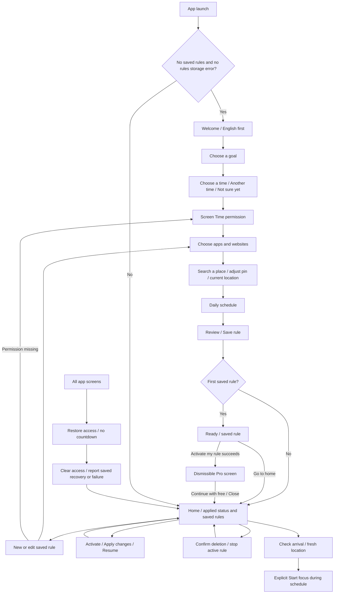
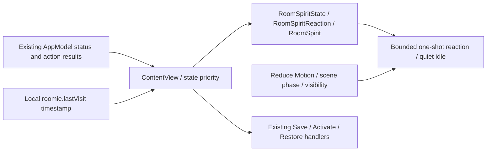
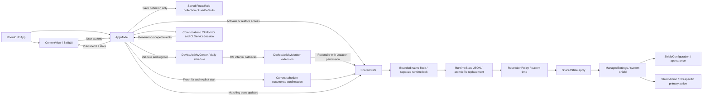
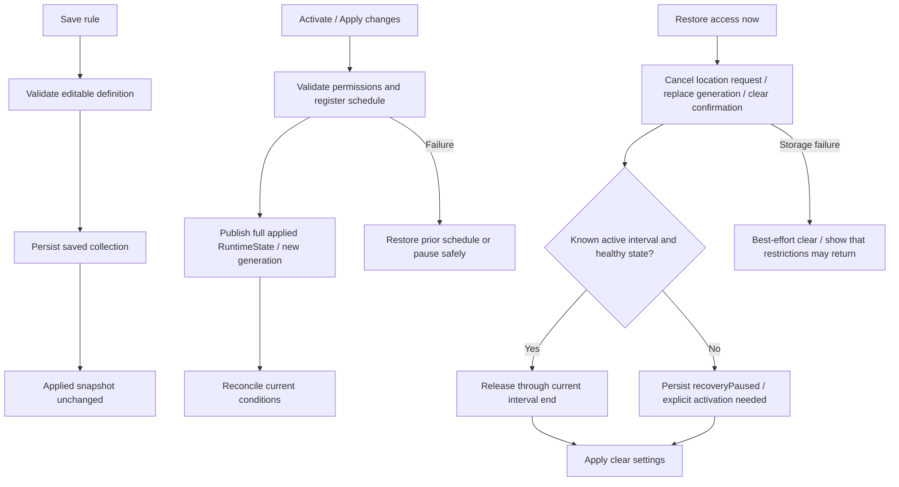
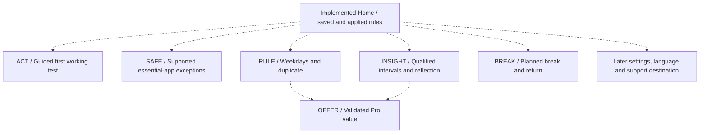
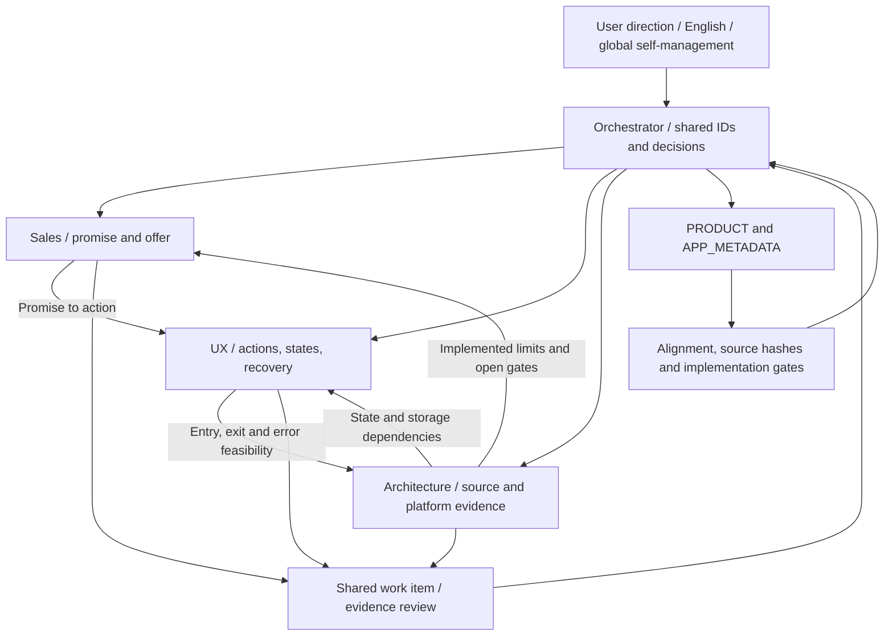

# Offzone 앱 구성 및 전략 연결 그래프

## D-46 Android 우선·핵심 화면 동기화 · 2026-09-25

Android `OnboardingScreen`의 목표·시간 선택(기본 3개, 직접 선택, 목표별 추천) → `RuleEditorScreen`의 앱·장소·시간·검토 → `MainActivity`의 저장 후 Ready → 연결된 차단 서비스에서 `Activate my rule` 성공 → `ProPaywallScreen`의 무료 계속하기/닫기 → Home을 연결했다. 홈 카드는 실제 집중 중만 차콜이고 예약·일시중지는 따뜻한 아이보리다. Android 13+ 앱별 언어 목록은 영어·한국어다. 사용자가 Android를 주 개발 기준으로 지정했으며 iOS Screen Time과 Android Accessibility/앱 패키지 선택은 플랫폼별 고유 경로다. 결제 준비 플래그는 여전히 꺼져 있고 AAB 생성과 Play 업로드는 별개다.

## D-45 첫 규칙 시간·Pro 진입 · 2026-09-25

**iOS 소스 확인:** `ContentView.rhythmScreen`은 아침/오후/저녁과 `Another time` 네이티브 시작 시각 선택, `Not sure yet` 목표별 추천 1시간을 제공한다. 첫 규칙의 Save 성공 → Ready → `Activate my rule` 성공 → 홈 위 `RoomPaywallView` sheet로 연결된다. 실패 시 Ready에 머물고 `Go to home`으로 구매 없이 이동할 수 있다. Pro 화면에는 `Continue with free`/닫기와 상품 복원이 있으며 앱의 무료 `Restore access` 경로는 유지된다. `RoomProOfferReady=false`인 현재 빌드에는 체험·가격·구매 주장이 없다. Android 동등 흐름과 실제 기기·구매 검증은 남아 있다. 첨부 영상은 시각 참고다.

## D-44 Nook Cat 현재 연결 · 2026-09-25

**확인된 소스 관계:** [디자인보드 F](.growth-design/mascots/2026-09-25-cute-10x10/index.html#candidate-F) → 내장 image_gen 새 RGBA 12컷 [manifest](.growth-design/mascots/2026-09-25-nook-native/manifest.json) → iOS `OffzoneNook-*` 12 imageset / Android `nook_*` 12 drawable. iOS `RoomSpiritState` 13개는 `OffzoneNookExpression` 표정8과 큰 슬롯의 `OffzoneNookFullBody` 전신4로 매핑된다. Android `OnboardingScreen`은 `NookCatView` 전신 환영·준비/집중 표정, `MainActivity` 홈은 준비/집중 전신에 연결한다. Android의 나머지 번들 상태는 아직 화면에 연결되지 않았다. 영어·한국어 마스코트 설명만 교체하고 명시적 **Start focus**와 무료 **Restore access**의 정책 경로는 그대로 둔다. iOS 대상 XCTest 1/1(최종 여백 수정 전)·최종 증분 빌드와 한국어 첫 화면/영어 네 화면, Android 에뮬레이터 2/2와 네 화면 캡처는 네이티브 배치 증거이며 실기기 동작·출시·완전한 clean alpha 보장은 아니다. 공식 `off` 아이콘/스토어 초안은 이번 마스코트 적용 범위가 아니다.

**현재 범위:** Nook의 장착·보상·구매 기능은 없다. 아래 Rue wardrobe 엣지는 과거 제품 제안으로 보존하며 현재 Nook 기능이나 출시에 필요한 승인으로 읽지 않는다. `graphify-out/` 자동 AST는 오래된 스냅샷이고 `APP_GRAPH.json`은 현재 관계를 수동 큐레이션한 그래프다.

## D-43 Rue v6 연결 / 후속 wardrobe 의존성 · 2026-09-24 (과거 구현)

**소스 확인, 구현:** `RoomDNS/App/ContentView.swift`의 `RoomSpiritState` 13상태 → `OffzoneRueExpression` 상반신8 (Home 84×96pt 등)과 넓고 높은 슬롯의 `OffzoneRueFullBody` 4종. 정적 그림을 기존 한 번 반응/축소 동작에 적용; 더 이상 Kiwi HEVC/포스터/`KiwiLoopView` 경로 없음. 실행 전 `SafetyReleaseView`는 `.attentive`, 성공 후 기존 home recovery 상태만 `.recovered`. `RoomDNS/Assets.xcassets/OffzoneRue-*` 12세트와 영/한 Rue 접근성 문구. Android `OnboardingScreen.kt`→`RueView(WELCOME)` 및 `MainActivity.kt`→`RueView(READY/FOCUSED)`만 실제 연결; `RueExpression`에는 12 drawable이 있어도 Android 12개 상태의 화면 연동은 **없다**. `KiwiView`/WebP/vector는 설치 리소스에서 제거해 이전 원본을 `.growth-design/mascots/2026-09-24-kiwi/`에 보존. iOS Simulator build+2 XCTest/Android debug+instrumented emulator 2/2/첫 화면 캡처는 화면 구현 증거이지 실기기 차단 성공 아님. 공식 아이콘/실제 화면 보드 revision20/Play 기존 초안 미변경.

**제안(미구현) 엣지:** Profile —optional→ Wardrobe UI —preview→ OutfitId —equip only if owned→ Inventory (starter free base / verified grant / verified purchase), —fallback→ free base. GrantEvent는 안전한 자발적 활동 검증·중복 방지 원장 필요. PaidSKU → 플랫폼 디지털 상품·signed transaction/receipt → entitlement ledger → restoration/refund/revocation/계정 연동; 기존 RevenueCat Pro·unlock pass와 분리. OutfitId —renders→ **해당 상태에 맞는 8상반신+4전신 완성 아트** 없이는 사용자 장착 불가. 당시 Rue 전신 PNG 3개는 콘텐츠 **시안만**. 환불·권한/복구·오프라인에서도 단일 인벤토리 버그가 무료 `Restore access`를 막지 못해야 한다. 출시에 사용권·clean alpha·84×96pt/스크린리더·iOS/Android 실기기 QA 필요. [의상 설계](.growth-design/mascots/2026-09-24-rue-wardrobe/WARDROBE_PLAN.md). JSON의 수동 큐레이션 그래프는 갱신했지만 `graphify-out/` 자동 AST는 옛 스냅샷으로 분리한다.

2026-09-16 최신 변경: NFC 실행·권한·고객 흐름 제거, 과거 규칙 디코딩만 유지. MapKit 장소 검색/핀 조정 → 신선한 위치 확인 → 일정 안에서 명시적 **Start focus**로 연결한다. CLMonitor는 위치 확인을 깨우며 단독으로 도착이나 차단을 확정하지 않는다. 현재 소스에 대한 수동 그래프 갱신이며 아래 과거 AST·테스트 수치를 이번 검증으로 재사용하지 않는다.

2026-09-09 보완: `UnlockPassView` → `AccountStore.reconcilePreviousUnlockPass()` → `reconcileUnlockPass` 경로 추가. 서버 미도달 요청은 취소 원장을 먼저 저장하여 지연 차감을 막는다. 기존 pending/spent는 기록을 보존하고 지원 문의를 제공한다. 완전한 자동 보상이나 유료 출시 완료를 의미하지 않는다. 구현·검증 범위는 [_workspace/UNLOCK_RECONCILIATION_STATUS.md](_workspace/UNLOCK_RECONCILIATION_STATUS.md).

Strategy revision: **G1** · 구현 기준: **R1 핵심 변경 / 진행 중** · 메타데이터: **1.3.3** · 기준일: **2026-09-25**

영어를 고객용 원본 언어로 쓰는 글로벌 성인 디지털 자기관리 앱이 기준이다. 고객 상황은 **Work · Rest · Time with people · Personal time**이며 학생·한국 시장으로 한정하지 않는다. 결정은 [ORCHESTRATOR.md](ORCHESTRATOR.md), 고객 약속은 [세일즈 보고서](SALES_STRATEGY_REPORT.ko.md), 화면 행동은 [UX 보고서](UX_STRATEGY_REPORT.ko.md), 단계는 [업그레이드 계획](APP_UPGRADE_PLAN.ko.md)을 따른다.

**R1 전체 완료가 아니다.** 이번 코드에는 영어 원본, 저장/적용 분리, 삭제, 상시 무료 복구, 적용 상태 저장과 콜백 보호가 들어갔다. 수동 체험·필수 앱 예외·실기기 검증은 남아 있고 R2/R3는 미착수다. 앱 이름과 달리 DNS 서버나 VPN 필터를 구현한 것이 아니다.

## 읽는 순서와 근거

- 이 문서: 현재 화면·상태 흐름과 남은 제안을 함께 읽는 제품 지도.
- [APP_GRAPH.json](APP_GRAPH.json): 기능 12개, 공통 작업 8개, 소스 근거·상태·해시를 연결한 제품 그래프.
- [탐색형 코드 그래프](graphify-out/graph.html): Swift 8개 파일의 구조. [미리보기](graphify-out/graph-preview.png).
- [자동 추출 보고서](graphify-out/GRAPH_REPORT.md), [원본 관계](graphify-out/ast-extraction.json), [무결성 진단](graphify-out/health.json).

2026-09-07의 네이티브 디자인 적용은 `ContentView`의 종이색·파스텔·여백 중심 화면과 Roomie 상태·단발 반응·접근 가능한 인사를 연결한다. 이번 적용에서 `AppModel`, `RestrictionState`, 확장 이벤트 경로는 변경하지 않았다. 제품 그래프에는 소스로 확인한 표현 관계를 추가했고, 자동 추출 구조 그래프는 기존 R1 스냅샷으로 남긴다. 소스 해시는 파일 판별값이며 화면 품질·모션 실행·실기기 차단 성공의 증거가 아니다.

| 표기 | 의미 | 주의 |
|---|---|---|
| EXTRACTED | 현재 코드·설정·지정 문서에서 직접 확인 | 코드 존재·시뮬레이터 성공은 실기기 성공이 아니다 |
| INFERRED | 확인된 사실에서 도출한 설계 의존성·제안 | 아직 구현된 기능으로 읽지 않는다 |
| AMBIGUOUS | 실제 동작·완료 여부를 판단할 근거 부족 | 실기기·고객·정책 검증이 필요하다 |

현재 그래프의 실선은 소스 관계, 제안 그래프의 점선은 앞으로 필요한 관계다. JSON은 각 노드·엣지에 구현 상태와 근거 수준을 따로 기록한다.

## 1. 현재 고객 화면 구성 — EXTRACTED

근거: `ContentView.swift:73` 초기 분기, `:114` 상시 복구, `:133` 복구 결과, `:142` 삭제 확인, `:509` Home, `:642` 규칙 행, `:994` 저장 완료, `:1047` 복구 화면. JSON에는 대응 기호 앵커도 기록한다.

현재 Home은 **현재 적용 내용과 저장한 규칙을 구분**한다. `Unapplied changes`를 표시하고 별도 `Apply changes`로 적용한다. Home의 설명은 적용 스냅샷을 읽는다. 비활성·일시중지 상태에도 저장 규칙이 있으면 Home으로 들어온다. 새 규칙·편집에 필요한 권한이 없으면 권한 화면을 거친다.

저장된 규칙은 여러 개이고 활성 규칙은 하나다. 규칙 삭제에는 확인이 있으며 활성 규칙은 먼저 비활성화하고 일정·장소 모니터를 정리한다. 상태는 홈 상태 영역, 행동 실패는 `actionFeedback`으로 표시한다. 정상 성공 설명은 반복 표시하지 않는다. History, Pro, 수동 체험, 요일 선택 화면은 아직 없다. 별도 Settings 탭도 없으며 현재 시스템 설정 링크를 제공한다.

### 네이티브 Roomie 표현 관계 — 2026-09-07 소스 확인

- 홈의 실제 상태·시간은 모델에서 읽는다. 오류·권한 문제, 집중, 복구가 단발 축하·재방문 반응보다 우선한다. 저장 성공과 활성화 성공은 별도로 처리하며, 버튼 탭만으로 제한 작동을 연기하지 않는다.
- Roomie는 기존 실루엣을 유지하며 12개 상태를 가진다. `RoomSpiritReaction.sample`은 환영·안내·수긍·저장 결과·복귀·예정 종료·복구의 짧은 반응을 계산한다. 집중·처리·주의 상태에는 축하 동작을 넣지 않는다.
- 인사 버튼은 접근성 이름과 힌트를 제공한다. Reduce Motion, 비활성 scene, 사라진 뷰에서는 동작을 정지하고, 집중·오류·복구 중 직접 탭은 조용한 인사로 제한한다.
- `roomie.lastVisit`은 48시간 후 복귀 인사를 위한 로컬 시각이다. 누적 보호 시간·연속 기록·분석 전송이 아니다. 기존 규칙을 다시 활성화하는 버튼은 기존 모델 메서드를 호출한다.
- 이번 그래프 검토는 소스 관계 확인이다. 빌드·테스트·렌더 검증은 오케스트레이터의 실제 결과로 별도 기록한다. 재방문율 개선, 전체 접근성 통과, 실제 기기 차단·복구 성공은 입증하지 않는다.

## 2. 현재 런타임과 저장 구조 — EXTRACTED

| 구성 | 현재 역할 | 근거 |
|---|---|---|
| App entry | AppModel 하나를 만들고 ContentView에 전달 | `RoomDNS/App/RoomDNSApp.swift:4` |
| ContentView | 영어 온보딩, 상태·규칙, 지도, 복구·삭제·오류 표시, Roomie | `RoomDNS/App/ContentView.swift:54` |
| AppModel | 저장/적용·삭제 분리, 권한, 신선한 위치 확인·명시적 시작, 장소 모니터 생명주기 | `RoomDNS/App/AppModel.swift:18` |
| FocusRule | 사용자가 저장한 이름·대상·일정·GPS 장소 정의, 과거 NFC 디코딩 호환 | `RoomDNS/Shared/RestrictionState.swift:22` |
| RuntimeState | 적용한 규칙·enabled·generation·장소·일정별 시작 확인·해제 만료·복구 일시중지 | `RoomDNS/Shared/RestrictionState.swift:204` |
| SharedState | 규칙 읽기/저장·legacy 변환, 잠금 안에서 적용 상태 읽기·변경·기록·제한 반영 | `RoomDNS/Shared/RestrictionState.swift:247` |
| RestrictionPolicy | 현재 시간과 모드·해제 조건에 따른 차단 여부 계산 | `RoomDNS/Shared/RestrictionState.swift:37` |
| DeviceActivityMonitor | 일정 콜백에서 공통 reconcile 호출 | `Extensions/DeviceActivityMonitor/DeviceActivityMonitorExtension.swift:17` |
| ShieldConfiguration / Action | 시스템 차단 화면 표현·기본 버튼 응답 | `Extensions/ShieldConfiguration/ShieldConfigurationExtension.swift:5`, `Extensions/ShieldAction/ShieldActionExtension.swift:3` |

`RuntimeState`는 App Group의 `runtime-v1.json`에 저장한다. 교체되지 않는 별도 `runtime.lock` 파일을 이용해 최대 5회·회당 2ms 대기하는 잠금 획득을 시도한다. JSON은 atomic write를 사용하고 파일 보호는 첫 사용자 잠금 해제 이후 접근 가능한 형식으로 지정한다. 서명 없는 시뮬레이터는 별도의 로컬 샌드박스를 쓴다. 이 설계와 코드 존재는 기기 잠금·프로세스 중단 시 OS 성공 보장이 아니다.

규칙 정의는 기존 App Group UserDefaults에 유지한다. `readRules`는 누락·잘못된 타입·디코딩 실패를 구분하고 중복 ID·일정 값을 검사한다. `saveRules`는 손상 원본을 덮어쓰지 않고 기존 Data의 최초 백업을 유지한다. 처음 runtime 파일을 만드는 때만 legacy 값을 읽고, 이후에는 `rule=nil`인 명시적 비활성도 저장한다. 모르는 스키마/손상 runtime은 자동으로 초기화하지 않는다.

현재 차단 계산은 `enabled ∧ 복구 일시중지 아님 ∧ 대상 존재 ∧ 현재 일정 안 ∧ GPS 장소 안 ∧ 현재 일정 회차의 명시적 시작 확인 ∧ 안전 해제 만료 전 아님`이다. 일정 활성값을 별도 저장된 bool로 신뢰하지 않고 현재 규칙·시간으로 계산한다. AppModel은 Screen Time 권한도 확인한다.

## 3. 저장·활성화·복구 계약 — EXTRACTED

- **Save/Activate:** `saveRule`는 정의만 저장한다. `activateRule`은 일정 등록 후 새 적용 스냅샷을 반영한다. 적용 실패 시 이전 일정을 복구하고 상태를 갱신하며, 복구도 실패하면 일시중지·해제를 시도한다. (`AppModel.swift:304`, `:404`)
- **복구:** 모든 앱 화면에 무료 진입점이 있고 강제 10초 대기는 제거됐다. 복구는 시작 확인을 지운다. 정상 GPS 구간에서도 새 위치 확인과 명시적 Start focus 전까지 재차단하지 않는다. 일정 밖·권한/저장·위치 상태가 불명확하면 일시중지하며 명시적으로 활성화해야 재개한다. 저장 실패는 성공으로 숨기지 않고 제한이 돌아올 수 있음을 안내한다. (`AppModel.swift:546`; `SharedState.restoreAccess:288`)
- **늦은 콜백:** 복구·활성 전환에서 generation을 바꾸고, 위치 응답은 요청 당시 generation을 확인한다. GPS identifier에 generation을 포함하며 이전 조건 이벤트를 거른다. 취소·교체 시 모니터 정리 경로도 있다. 새 규칙·편집·지도 선택으로 전환할 때 현재 위치 조회도 취소해 늦은 응답이 새 초안을 덮지 않게 한다. (`AppModel.swift:525`, `:661`, `:722`, `:962`)
- **관찰 한계:** `isFocused`는 계산된 정책 상태다. 실제 OS 차단을 조회한 값이나 보호 시간 기록이 아니다. NFC 실행은 제거했고 기존 데이터는 디코딩·편집을 위해 보존한다. GPS는 오차를 고려한 주변 장소 판정이며 자동 방 감지·즉시 반응을 보장하지 않는다.

파일 저장과 ManagedSettings의 OS 반영은 서로 다른 동작이다. 시뮬레이터 잠금 검사·상태 테스트로 실제 차단·복구까지 원자적으로 보장됐다고 해석하면 안 된다. runtime 손상·읽기 불가 때 원본을 보존하는 경로와 실제 고객 복구의 충분성은 실기기·사용성 단계에서 확인한다.

## 4. 영어 우선 전환과 남은 화면 — ALIGN-01

고객용 Swift 키와 Xcode `developmentRegion`이 영어로 변경됐다. 영어·한국어 리소스에는 기존 키의 호환 별칭도 남아 있다. 온보딩·상태·권한 안내·shield 문구를 영어 원본으로 운영한다. 현재 앱 소유 화면은 밝은 종이색·차분한 파스텔과 큰 상태 영역을 사용한다. 전체 언어·접근성 실기기 검증은 아직 필요하다.

근거: `RoomDNS.xcodeproj/project.pbxproj:386`, `AppModel.swift:10`, 한·영 `Localizable.strings`와 `InfoPlist.strings`, `ShieldConfigurationExtension.swift:6`.

위 점선은 미구현 제안이다. 처음부터 탭을 늘리거나 새 모듈을 만들자는 결정은 아니다. ‘약 60초 작동 체험’은 고객 절차 목표이며 현재 최소 15분 일일 일정을 60초로 바꿔 구현하지 않는다. 별도 안전한 종료·중단 경로가 검증되기 전에는 해당 흐름을 노출하지 않는다.

## 5. 공통 작업과 구현 의존성

| 공통 ID | 현재 반영 | 남은 조건·의존성 |
|---|---|---|
| ALIGN-01 | 영어 Swift 원본·Xcode en·한영 리소스 반영 | 영어/한국어 전체 여정·권한·shield·VoiceOver 실기기 검증 |
| CORE-01 | 적용 스냅샷·파일 잠금·현재 시간 재평가·콜백 생명주기 | 서명된 iPhone에서 차단/해제·잠금·종료·권한·시간 변경 검증 |
| SAFE-01 | 상시 복구·무대기·구간 해제/일시중지·실패 안내 | **필수 앱 예외 미구현**, 실제 재접근·저장/잠금 실패 복구 검증 |
| ACT-01 | GPS 장소 선택·확인·명시적 시작 | **수동 체험 미구현**; CORE/SAFE 후 체험·이탈·복구 설계 |
| RULE-01 | 저장/적용 분리·적용 차이·삭제·원본 보존 | 요일·복제와 해당 데이터 호환·실기기 검증 |
| INSIGHT-01 | 미구현 | 공유 적용 지점의 최소 기록, 중복·불명 구간·삭제·회고 |
| BREAK-01 | 미구현 | 안전 해제와 별도 휴식 상태, 실제 예약·복귀 검증 |
| OFFER-01 | 미구현·상품 미확정 | 반복 가치·상품 경계·구매/복원·심사 검증 |

이 표는 독립적인 우선순위 백로그가 아니다. 단계·가격·완료 결정은 ORCHESTRATOR와 업그레이드 계획이 소유한다. 기능 `safety_release`의 `implemented_unverified`와 SAFE-01 전체 완료는 다르다. SAFE-01에는 아직 없는 필수 앱 예외와 실제 복구 검증이 포함된다.

## 6. 세일즈·UX·아키텍처 협동 그래프

예: “언제든 무료로 접근을 복구한다”는 약속에 대해 이번 UI는 상시 버튼을 제공하고 코드는 무대기 해제를 시도한다. 하지만 실제 iPhone의 재접근 확인은 남아 있다. 세 담당은 **SAFE-01**에 코드·화면·실기기 결과를 모아야 하며 버튼 구현만으로 출시 통과나 필수 앱 예외 제공을 주장하지 않는다.

제안 의존성은 `ACT → CORE + SAFE`, `RULE 확장 → CORE + SAFE + 데이터 호환`, `BREAK → CORE + SAFE`, `INSIGHT → CORE 상태 정의 + 휴식 상태를 구분할 설계`, `OFFER → 제공할 RULE/INSIGHT 가치 + SAFE 독립성`이다. 모든 제안 기능의 완성이 항상 출시 전 필수라는 뜻은 아니다.

## 7. 추출 품질·검증 한계·갱신

자동 AST 스냅샷은 네이티브 Roomie 적용 이전의 Swift **8개 파일(런타임 7 + 테스트 1), 약 10,744단어**만 대상으로 기존 graphify 파이프라인을 갱신했다. 빌드 결과·이미지·외부 라이브러리·전략 문서는 AST 대상에서 제외했다. 민감 파일로 건너뛴 파일과 스캔 오류는 각각 0개다.

- 원본: 노드 레코드 **317개 / 엣지 824개**.
- 정규화 결과: **노드 301개 / 방향 엣지 732개 / 커뮤니티 13개**.
- **주의: 같은 출발·도착의 92개 엣지가 DiGraph에서 합쳐졌다.** 원본 관계·위치는 `ast-extraction.json`에 보존했다. 빠진/존재하지 않는 끝점·자기 루프·완전 중복 엣지는 0개다.
- 커뮤니티 응집도는 자동 보고서에 원시 숫자로 공개한다. 구조 밀도이며 앱 품질 점수가 아니다.
- Swift AST는 OS 콜백 성공, 파일 보호·프로세스 중단, App Group 공유, 실제 차단을 검증하지 않는다. 시뮬레이터와 기기 분기는 같은 코드 그래프에 포함된다.
- 외부 LLM 추출 토큰은 입력/출력 각각 **0**이다. 에이전트 소스 검토·제품 그래프 갱신 토큰은 따로 측정할 수 없어 **미상**이다. benchmark는 도구의 일반 질의 크기 추정이며 실제 업무 비용·정확도 개선 수치가 아니다.

오케스트레이터의 최종 시뮬레이터 로그에서 **XCTest 10개, 실패 0개**를 확인했다(`/tmp/roomdns-r1-tests-verified.log`). 해당 로그에는 ManagedSettings·FamilyControls 실권한 미사용 오류도 있으므로 실제 차단 성공 증거로 쓰지 않는다. unsigned 빌드와 시뮬레이터 검사는 통과 범위만 설명한다. 실제 iPhone·개발 Team·서명·배포 권한·현장 GPS·접근성·고객 사용성 검증은 남아 있다.

갱신 명령은 `python3 tools/check_product_alignment.py`와 graphify Python으로 실행하는 `graphify-out/rebuild_graph.py`다. 코드가 바뀌면 영향 관계·소스 해시를 다시 확인한다. 자동 그래프 갱신은 기능 상태를 승격하지 않는다. 이번 Architecture 갱신에서는 앱 소스·빌드·테스트를 변경하거나 실행하지 않았다. 현재 네이티브 표현 관계는 APP_GRAPH의 수동 소스 검토로 보완했으며, 위 AST 수치와 과거 테스트 기록을 새 디자인 검증으로 승격하지 않았다.

최종 네이티브 디자인 검증(2026-09-07): iPhone 17 Pro / iOS 26.5 빌드·설치·실행 및 XCTest 12개/실패 0개. 홈과 장소 설정 화면을 확인했다. 근거와 검증 한계는 [NATIVE_DESIGN_STATUS.md](NATIVE_DESIGN_STATUS.md)를 따른다. 위 R1 10개 검사 기록은 과거 증거로 유지한다.

## 8. 리포트 기반 네이티브 확장 (2026-09-07)

ACT-01: ContentView → OnboardingProfile(목표/시간 제안·완료 상태), 실제 규칙 저장/활성화는 기존 AppModel을 사용한다. OFFER-01: RoomDNSApp → AccountStore → Firebase Auth/Firestore(목표만), RevenueCat(UID 연결·상품·검증된 구독 상태). AccountViews는 로그인·계정 삭제·구독 UI를 제공한다. SAFE-01: 구매·로그인 의존성은 기존 복구/제한 정책에 추가되지 않았다. ALIGN-01: 기존 시스템 서체와 한영 리소스를 유지한다.

APP_GRAPH.json에 영향 관계와 기능 3개를 추가했다. AST 그래프는 과거 스냅샷이며 다시 추출한 것으로 주장하지 않는다. 외부 설정이 없어 계정·구독은 출시 검증 완료가 아니다. [최신 검증 범위](PAYWALL_UPGRADE_STATUS.md).

## 9. D-12 구역 알림 및 조기 종료 화면

CORE-01/RULE-01의 `RestrictionNotificationSnapshot`이 공유 런타임에 마지막 정책/위치 관찰을 보관한다. `accessRuntime`의 잠금 안에서 변경을 계산·저장한 뒤 ManagedSettings 적용과 로컬 알림 제출을 수행한다. `AppModel`의 신선한 CLLocation 기반 진입/이탈·명시적 시작, 기존 DeviceActivity 확장 재평가가 이 경로를 공유한다. 불명확 위치를 구역 이탈로 알리지 않는다. 전달은 best effort이며 앱이 이벤트 제출 직전에 종료되거나 저장/OS 제출이 실패하면 누락될 수 있다. 알림은 물리 차단 성공을 독립 검증하지 않는다.

`ContentView` 벨 → 알림 opt-in/설정. 일반 종료·집중 중 활성 규칙 교체/삭제 → `UnlockPassView` → 유지 또는 무료 오류/긴급 복구. D-18에서 실제 상품/PASS 잔액과 서버 원장을 연결했지만 별도 준비 게이트가 false라 판매 호출은 비활성이다(OFFER-01/SAFE-01). 소스 기반 수동 그래프 갱신이며 역사적 AST 그래프 전체를 재생성하지 않았다.

## 10. D-13 앱 삭제 제한

`FocusRule.preventAppRemoval`은 optional Boolean으로 기존 저장 형식을 보존한다. `AppModel`의 draft 생성/로드/저장/미적용 비교 → `ContentView` 규칙 검토 Toggle → 명시적 활성 스냅샷 → 공유 `apply`의 `application.denyAppRemoval` 순서로 연결된다. `shouldShield` false 경로와 기존 `clearRestrictions`는 같은 ManagedSettings 저장소를 모두 비워 삭제 제한도 해제한다. `.individual` 권한은 철회 가능하며 전체 기기 잠금 API나 결제 소비 경로는 추가하지 않았다. CORE-01/RULE-01/SAFE-01, 기기 증거는 미확인이다.

2026-09-07 서비스 설정: Firebase Apple provider/Firestore 배포 규칙 조회 검증 완료. RevenueCat iOS 앱·offzone_pro·공개 SDK 키 구성. Apple 구매 키 인증 HTTP 401과 실제 상품/기기 검증은 남아 있어 account/subscription 기능 상태는 partial 유지. [설정 기록](ACCOUNT_PURCHASE_SETUP.md).

### D-16 configuration and backend evidence
Three draft App Store/RC products, offzone_pro packages and PASS are configured. Firebase callable spend → server-only Firestore receipt → RC currency transaction; Auth delete → RC deletion retry. Source: functions/index.js and functions/purchases.js. Both functions are **deployed ACTIVE**, using secret version 1; live missing/invalid-token requests returned 401. D-18 wires the disabled client path; local emulator and synthetic RC ledger checks passed, but signed-device purchase/grant/spend remains open. Apple sandbox TEST notification delivered; production notification API remains 401. ACCOUNT_PURCHASE_SETUP.md owns current product IDs and pending gates.

## 11. D-18 해제권 클라이언트 연결

`UnlockPassView` → `AccountStore` → RevenueCat consumable/PASS balance → FirebaseFunctions `spendUnlockPass` → Firestore receipt/RC debit. `AccountStore` stores the UID-specific session ID in an atomic local file before the call and retains it until local completion, allowing an exact replay after a lost response even when the visible balance is already zero. `AppModel` delegates to `SharedState.restoreAccess(usingUnlockPass:)`, which compares the SHA-256 ID from the current runtime generation and schedule occurrence and applies the release inside the same runtime lock.

The independent `RoomUnlockPassReady=false` gate keeps all paid controls and network calls off. A stale response never releases a newer session; the corresponding compensation/cleanup policy is unresolved, so this path is partial and not release-ready. Free recovery does not depend on AccountStore, RevenueCat or FirebaseFunctions.

## D-22 / OFFER-01 · INSIGHT-01 — 2026-09-09
Pro includes app-owned weekly intention planning and private, self-reported daily reflections with weekly counts. This is not automatically measured Screen Time, focus duration or saved time. New writes require a verified current-account Pro entitlement that has not expired. Reading, deleting and exporting existing local records remain available after expiry or sign-out; no cloud sync or backup is promised. The implemented UI is in Account & plan → Plan & reflect. Sales flags remain disabled pending pricing, real purchase validation and product review. Pass USD0.99 was approved and saved; Pro monthly/annual price is not yet confirmed. See `_workspace/PRO_IMPLEMENTATION_STATUS.md` for checks and limitations.

### D-24 authentication update
ACT-01/OFFER-01: AccountStore now supports Apple, Google and email/password with explicit Firebase credential linking to the current UID, verification/reset, and provider-specific reauthentication for deletion. RoomDNSApp forwards Google OAuth callbacks; GoogleSignIn9.2.0 is linked only to the app. Firebase provider readback is complete; source checks do not prove real OAuth, email delivery, or account/purchase restoration. Existing feature ID apple_account remains for compatibility.

## 2026-09-16 장소 확인과 명시적 시작 — CORE-01 / RULE-01 / SAFE-01

`RestrictionPolicy.placePresence`는 신선도 30초 이하·수평 오차 100m 이하의 위치만 받는다. 중심 거리+오차가 150m 이하면 진입, 거리−오차가 200m보다 크면 이탈이며 중간 영역에서는 직전 신뢰 상태를 유지한다. 실패/오래된 위치는 새 집중 시작에 쓰지 않는다. 이 수치는 기기 정확도 보장이 아니다.

`AppModel.startPlaceFocus` → 현재 generation을 붙인 위치 요청 → `updatePlaceArrival` → `SharedState.startPlaceFocus` 순서다. `RuntimeState.placeFocusOccurrenceStart`는 현재 일정 회차와 일치해야 차단할 수 있다. 자정을 지나는 같은 회차는 유지하고 다음 회차·이탈·복구·규칙 재활성화는 새 시작을 요구한다. 기존 GPS 런타임은 해당 optional 필드가 없으므로 자동 재차단하지 않는다. 과거 NFC 규칙은 원본을 유지하지만 활성화·차단은 거부한다.

고객 문제는 잘못된 장소 감지에 따른 의도치 않은 차단이다. 약속은 장소를 선택하고 도착을 확인한 뒤 사용자가 시작한다는 것까지다. 실제 GPS 실내/경계/백그라운드·OS 차단·복구·접근성 검증은 별도 실기기 게이트다. 신규 테스트 결과와 최종 소스 해시는 오케스트레이터가 기록한다.

## 2026-09-22 Android 첫 구현 — CORE-01 / SAFE-01 / ACT-01

사용자 결정에 따라 iOS를 유지하고 `android/`에 Kotlin·Jetpack Compose 구현을 추가했다. 아래는 수동 소스 검토로 확인한 구조이며 빌드·기기 동작 검증 완료를 의미하지 않는다. 기존 iOS 그래프 상태와 역사적 AST 스냅샷은 그대로 유지한다.

| 소스 (`android/app/src/main/java/com/exchip/offzone/`) | 확인된 책임·관계 |
|---|---|
| `MainActivity.kt` | 앱 선택·명시적 동의·수동 시작·무료 복구 UI. `AppSelection`의 앱 목록과 `FocusController`의 상태 사용. |
| `AppSelection.kt` | 선택·동의만 로컬 저장. 시스템 앱과 홈·전화·키보드·설정·자기 앱 제외. |
| `FocusController.kt` | 프로세스 내 세션·서비스 연결·종료 상태 관리. 복구·연결·해제마다 generation을 바꾸어 조회 중이던 시작 요청을 무효화. |
| `FocusSession.kt` | 선택 패키지와 `elapsedRealtime` 기준 시작·종료 시각으로 차단 여부 판단. |
| `FocusAccessibilityService.kt` | window-state 패키지 이벤트 → 필수 앱 예외·세션 확인 → 스크롤 가능한 접근성 오버레이. 무료 복구·만료·서비스 정리 시 오버레이 제거. |

`focus_accessibility.xml`은 `typeWindowStateChanged`만 요청하고 화면 내용 조회를 비활성화한다. 활성 세션은 저장하거나 부팅 뒤 재개하지 않으며, 프로세스·서비스 종료는 세션 종료로 처리한다. 유료화·로그인·위치 자동화는 이 구현에 포함되지 않는다.

검토에서 발견한 비동기 시작/무료 복구 경합은 controller generation 확인으로, 큰 글꼴에서 복구 버튼이 잘릴 위험은 `ScrollView`로 보완한 소스를 확인했다. 실제 기기 증거는 별도다. 화면 켜짐·잠금 해제에서 foreground를 비우므로 기존 전면 앱이 새 window 이벤트를 내지 않으면 다음 이벤트까지 차단 화면이 다시 표시되지 않을 수 있다. 멀티윈도·제조사별 이벤트·권한 철회·절전 후 만료와 큰 글꼴 복구 도달성은 검증 게이트로 남는다.

APP_GRAPH.json에 Android 노드 5개·소스 근거 엣지 6개와 별도 검증 상태를 추가했다. 이 보충은 기존 iOS의 필수 앱 예외·실기기 검증 상태를 변경하지 않는다. 빌드·기기 확인 결과는 오케스트레이터가 후속 기록한다.

Android verification update (2026-09-22): debug build, unit test (1), lint (0 errors) and Android 16 emulator integration test (1) passed. UI selection/start, native shield, free restore, settings access, actual 60-second expiry, permission revoke and stale-start rejection verified. Evidence: `output/android-first-slice/`. Physical-device, unlock/multiwindow and Play gates remain open. Final home copy/disclosure scrolling changes passed rebuild/lint; the native flow was unchanged.
