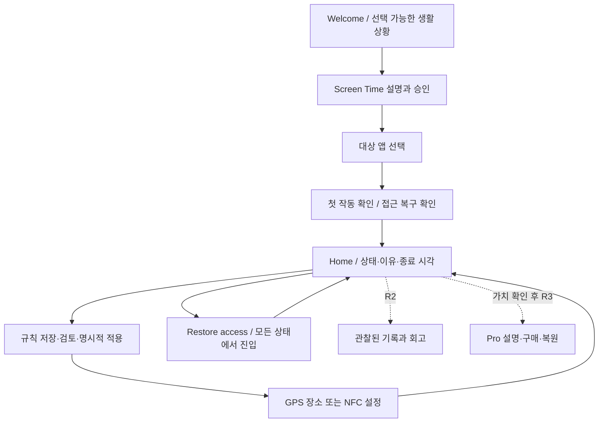
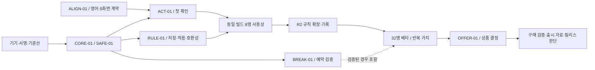

# Offzone 앱 업그레이드 실행 계획서

## 2026-09-24 Rue v6 전면 교체·후속 의상 시스템 게이트 (D-43)

사용자 명시 지시로 iOS/Android 앱의 Kiwi 그림/영상/이름을 성인 Rue v6 **기본 의상 정지 그림**으로 교체. iOS Simulator/Android emulator 첫 화면과 범위 내 테스트 통과; 실기기 위치/Screen Time·Accessibility /alpha fringe·원본성/권리/축소 검증이 완료된 출시 빌드가 아니다. [3개 추가 의상 전신 시안과 후속 단계](.growth-design/mascots/2026-09-24-rue-wardrobe/WARDROBE_PLAN.md)는 상품/유저 인벤토리 구현과 구분. 기본 룩을 항상 무료 제공하고, 향후 획득 이벤트는 신뢰할 수 있는 기록/중복 방지·오프라인/계정 복구, 유료 외형은 플랫폼 정책/검증 영수증·환불/복원/삭제/지원 게이트 뒤 별도 결정한다. 기존 Pro·통행권과 섞거나 현재 무료 Restore access·명시적 Start focus를 바꾸지 않는다. Play/아이콘/실제 보드/배포 미변경. 아래 R1/R2/R3와 당시 NFC 항목은 과거 전략 범위이며 최신 결정 우선.

## 2026-09-16 사용자 확정 — 장소 기반 수동 시작 / NFC 제거

CORE-01 / RULE-01 / ACT-01 / SAFE-01: 기존 Apple 지도에서 장소 검색·핀 조정, 오차를 고려한 주변 감지 후 사용자가 Start focus로 확정한다. 도착만으로 자동 차단하지 않으며, 새 회차·이탈·복구 후에는 다시 시작해야 한다. NFC 기능·UI·권한은 제거하고 기존 규칙 데이터는 편집용으로 보존한다. 방/책상 수준 위치 정확도를 약속하지 않는다. 영어 기본·한국어 보조 및 유료 판매 비활성 유지. 아래 NFC/자동 시작 관련 과거 계획보다 이 결정을 우선한다. 구현/검증 기록은 `_workspace/PLACE_FOCUS_IMPLEMENTATION.md` 참조.

Strategy revision: **G1** · Plan revision: **U1** · 작성일: **2026-09-06**

**목적:** 현재 iPhone 프로토타입을 영어 사용자가 혼자 설정하고, 일상에서 믿고 사용하며, 반복 가치에 비용을 지불할 수 있는 제품으로 발전시킨다.

**상태:** U1 실행 계획. 사용자 “단계별로 실행” 지시로 R1 첫 묶음을 구현 중이다. [현재 실행 기록](R1_IMPLEMENTATION_STATUS.md)을 함께 읽는다. 앱 구현·고객 검증·유료 상품·출시 일정이 확정되거나 완료된 문서가 아니다. 시니어 개발 리드와 제품 디자이너의 검토 관점으로 작성했으며 실제 경력이나 사용자 실험을 주장하지 않는다.

**상위 기준:** [ORCHESTRATOR.md](ORCHESTRATOR.md). 이 계획은 기존 공통 작업 8개를 실행 순서와 완료 조건으로 구체화한다. [세일즈 전략](SALES_STRATEGY_REPORT.ko.md), [UI/UX 전략](UX_STRATEGY_REPORT.ko.md), [앱 구성 그래프](APP_GRAPH.md), [메타데이터](APP_METADATA.json)와 함께 갱신한다. 과거 PRODUCT.md의 통행권·일정 예시는 G1과 이 계획에서 별도 채택한 범위에 한해 사용한다.

## 목차

1. 경영·제품 판단
2. 현재 상태와 우선 해결 문제
3. 출시 단위와 범위
4. 핵심 화면과 고객 여정
5. 개발 설계와 데이터 보호
6. 공통 작업별 실행 명세
7. 일정·인력·의존성
8. 검증·고객 조사·측정
9. 판매 준비와 출시 운영
10. 협업·변경 통제와 첫 실행 묶음
11. 근거와 계획서 검증

## 1. 경영·제품 판단

### 권고하는 제품 방향

Offzone의 상위 약속은 **“Make room for what matters.”**다. 구체적인 기능 설명은 **“Set boundaries for distracting apps around the places and times you choose.”**로 이어진다. 고객이 원하는 일·휴식·관계·개인 시간을 지키도록 돕는다.

영어를 UI·온보딩·오류·지원·스토어 문안의 원본으로 쓰고 한국어 현지화를 유지한다. `en-US`는 작성 기준이며 미국 단독 출시를 뜻하지 않는다. 출시 국가와 지원 시간대는 운영 가능성을 확인한 뒤 정한다.

| 고객 상황 | 첫 설정 예시 | 성공을 확인할 질문 |
|---|---|---|
| Work | 업무 중 산만한 앱을 내려놓는 규칙 | 원하는 일을 시작하고 이어갈 수 있었는가? |
| Rest | 저녁에 무심코 스크롤하는 시간을 줄이는 규칙 | 계획한 휴식을 가졌는가? |
| Time with people | 식사·대화 중 주의를 지키는 규칙 | 함께 있는 사람에게 집중할 수 있었는가? |
| Personal time | 독서·취미·학습을 위한 규칙 | 자신이 선택한 시간을 보냈는가? |

네 상황은 동일 기능의 예시와 메시지다. 별도 모드 네 개나 특정 직업·학생 전용 앱을 만들지 않는다. 수면 개선·집중력 향상·중독 치료 같은 효과는 측정 없이 판매하지 않는다.

### 투자 순서

1. **신뢰:** 설정·실행·종료가 일치하고, 문제가 생겨도 고객이 접근 권한을 되찾는다.
2. **이해:** 영어 사용자가 권한과 GPS/NFC의 차이를 이해하고 첫 작동을 확인한다.
3. **반복 가치:** 생활에 맞게 규칙을 관리하고, 관찰 가능한 기록으로 돌아볼 수 있다.
4. **판매:** 실제로 제공하는 추가 가치와 지불 이유를 확인한 뒤 상품을 만든다.

기능 수·앱 체류 시간·결제 화면 노출을 선행 목표로 삼지 않는다. 제품의 성공은 앱을 믿고 닫은 뒤 자신의 생활로 돌아가는 데 있다.

## 2. 계획 시작 시 상태와 우선 해결 문제

**아래 표는 R1 수정 전 기준선이다.** 현재 코드에서는 영어 전환, 저장/적용 분리, 상시 복구, 손상 데이터 보존이 반영됐다. 실기기 검증과 수동 체험은 아직 남아 있다.

계획 시작 시 메타데이터와 그래프의 기능 상태 12개, 공통 작업 8개, 코드·설정 해시 15개가 일치했다. 이는 문서와 소스의 정합성 확인이며 실기기 동작 증거는 아니다. 과거 빌드·시뮬레이터 결과는 [SPIKE_CHECKLIST.md](SPIKE_CHECKLIST.md)에 있으며 이번 계획 작성에서 재실행하지 않았다.

| 현재 확인된 사실 | 고객·개발 위험 | 계획상 대응 |
|---|---|---|
| iPhone, iOS 18+, SwiftUI와 Screen Time 계열 API 사용 | OS 이벤트·권한·서명에 영향을 받음 | CORE-01 실기기 검증을 선행 |
| 영어 번역 존재, 한국어 소스 키·`developmentRegion = ko` | 오류·권한·확장에서 한국어가 섞일 수 있음 | ALIGN-01 전체 고객 경로 점검 |
| 여러 규칙 저장, 한 번에 하나 활성 | 복수 규칙 동시 실행으로 오해할 수 있음 | 한 활성 규칙 유지, 상태·카피 명확화 |
| `saveRule`이 저장과 활성 전환을 함께 수행 | 편집만 해도 실제 제한이 바뀔 수 있음 | RULE-01 저장과 적용 분리 |
| 복구 진입이 `isFocused`에 의존하고 현재 10초 대기 | 상태 불일치 때 해제를 찾기 어려움 | SAFE-01 상시 진입과 오류 복구 |
| GPS는 기본 150m 장소 조건 | 방 단위·즉시 반응 약속 불가 | 경계·권한·지연 설명과 현장 검증 |
| NFC는 앱 내 URL 패턴 검사, 태그 ID 미저장 | 태그별 규칙 연결 불가; 실패 안내 누락 | 기존 범위 설명 후 연결 기능 단계 추가 |
| `FocusRule` 배열 디코딩 실패가 빈 목록으로 처리됨 | 새 필드를 잘못 추가하면 기존 규칙이 사라진 것처럼 보임 | 호환 디코더·원본 보존·마이그레이션 검사 |
| 세션 기록·수동 체험·계획 휴식·결제 미구현 | 보고서 제안을 현재 기능으로 판매할 위험 | 구현·검증 후에만 화면과 판매 약속 공개 |

핵심 근거: [AppModel.swift](RoomDNS/App/AppModel.swift)의 `saveRule`, `activateRule`, `safetyRelease`, `acceptFocusTag`; [RestrictionState.swift](RoomDNS/Shared/RestrictionState.swift)의 `FocusRule`, `SharedState.rules`, `reconcileRestrictions`; [ContentView.swift](RoomDNS/App/ContentView.swift)의 홈·장소·복구 화면. 위치·태그 콜백과 무료 해제 간 경합은 소스에서 확인한 **위험 가설**이며 실제 장애 발생률은 아직 모른다.

## 3. 출시 단위와 범위

아래 R1~R3는 계획상의 전달 단계이며 App Store 버전 번호가 아니다. R1·R2는 먼저 제한 베타로 전달한다. 공개 출시·유료화는 각 검증 조건을 통과한 뒤 판단한다.

| 단계 | 고객에게 전달할 결과 | 포함 범위 | 다음 단계 조건 |
|---|---|---|---|
| **R1 — 신뢰할 수 있는 첫 사용** | 영어로 이해하고, 작동을 확인하고, 필요하면 복구 | 영어 전환, 상태·복구, 저장/적용 분리, 삭제, GPS/NFC 안내·실패 노출, 안전한 수동 체험 | 실기기 핵심 경로·기존 데이터 보존 통과, 8명 사용성 게이트 |
| **R2 — 생활 속 반복 사용** | 생활 일정에 맞추고 다시 돌아볼 이유 확보 | 요일, 태그-규칙 연결, 장소 검색·복제, 최소 7일 기록·회고; 검증된 계획 휴식 | 32명 제한 베타, 관찰 가능한 반복 사용·문제 원인 확인 |
| **R3 — 가치에 맞는 판매** | 추가 가치와 가격을 이해하고 구매·복원 | 검증된 Pro 범위, 상품 표시·구매·복원·지원, 영어 판매 자료 | 상품 가치·심사·실기기·구매 상태 검증, 공개 출시 판단 |

**R1 필수 범위:** 무료 복구, 저장과 적용 구분, 영어 핵심 경로, 오류 노출, 기존 규칙 보존은 일정 압박으로 제거하지 않는다. 수동 체험은 안전하게 종료할 수 있어야 제공한다. 검증에 실패하면 GPS/NFC를 이용한 안내형 첫 확인으로 베타 범위를 축소하며 변경된 약속을 기록한다.

**R2 조건부 범위:** 자동 복귀가 불안정하면 계획 휴식을 제공하지 않고 기존 세션 종료·명시적 재개를 유지한다. 태그 연결은 완전한 설정·취소·재등록 흐름 단위로 출시한다. 주소 검색·복제는 규칙 관리 기반 뒤에 붙이며, 미완성 상태로 항목만 노출하지 않는다.

**보류:** 복수 규칙 동시 실행, 계정·클라우드 동기화, AI 코칭, 소셜 순위·연속 기록 경쟁, 하드웨어 제조·배송, 자체 DNS/VPN, 디자인 시스템 패키지, 대규모 분석 서버. 기존 구조의 한계나 고객 이탈 원인이 확인될 때 다시 평가한다. RTK 도입 여부는 개발 도구 검토이며 앱 업그레이드의 선행 의존성으로 두지 않는다.

## 4. 핵심 화면과 고객 여정

### 기본 여정



첫 작동 확인은 짧은 사용자 확인 절차다. 60초 후 백그라운드에서 반드시 자동 해제되는 기능을 의미하지 않는다. GPS 위치 권한은 GPS를 선택할 때 설명하고, NFC 경로에서는 위치를 필수 조건으로 요구하지 않는 것이 목표다.

### 먼저 완성할 다섯 화면 계약

| 화면 | 현재 → 목표 | 핵심 영어 문안 | 반드시 포함할 상태·행동 |
|---|---|---|---|
| Welcome·첫 체험 | 소개·권한·장소 설정 선행 → 가치 설명 뒤 작은 작동 확인 | `Make room for what matters.` / `Get started` / `Try blocking an app` | 상황 질문 건너뛰기, 권한 거절 후 설명·재진입, 체험 중단·접근 복구 |
| Home | 캐릭터·집중 상태·목록 → 실제 정책 상태와 다음 행동을 먼저 표시 | `Ready for your next session` / `Your rule is active` / `Your rule needs attention` | 규칙 이름·적용 이유·종료/다음 시각, 상시 `Restore access`, 오류 원인과 조치 |
| Rule review·manage | 저장 즉시 활성 → 저장·현재 적용을 분리 | `Save changes` / `Activate rule` / `Saved. Not active.` | 편집 취소는 실행에 영향 없음, 활성 규칙 변경 시 별도 적용, 삭제 영향 설명 |
| GPS·NFC setup | 지도 또는 태그 스캔 → 준비·검증·실패·다음 행동이 연결 | `Use this place` / `Scan your tag` / `Tag not recognized` | 150m 경계, 권한 상태, 앱 내 스캔, 준비된 태그 안내, 취소·타임아웃·재시도 |
| Restore access | 추정 집중 상태에서만 접근·10초 후 실행 → 항상 찾을 수 있는 복구 | `Restore access` / `End this session` / 필요 시 `Pause rules` | 현재 해제 범위·재개 조건, 오류·긴급 경로 무대기, 실패 확인·추가 도움 |

영어 문안은 목표 시안이다. 예를 들어 `Try blocking an app`은 실제 수동 체험 구현 후 사용한다. R1에서 복구의 강제 대기 제거 코드를 반영했다. 실기기에서 실제 접근이 복구되는지는 별도 증거가 필요하다. 이 절의 “현재 → 목표”는 계획 시작 시 기준선을 나타낸다.

### Home의 정보 위계

```text
Your rule is active             ← 현재 계산된 규칙 상태
Work time                      ← 어떤 규칙인가
Scheduled until 5:00 PM         ← 언제 조건이 끝나는가
At your saved place            ← 왜 이 상태인가

[View rule]                    ← 맥락에 맞는 주 행동
Restore access                 ← 항상 찾을 수 있는 복구

Your rules                     ← 현재 활성과 저장된 규칙 구분
```

OS의 실제 차단 결과를 읽은 상태가 아니므로 `All distractions blocked` 같은 검증되지 않은 확정 문구는 쓰지 않는다. 일정 밖·장소 밖·권한 불명확·무료 해제 후 상태도 같은 위계로 읽혀야 한다. 로딩 중에는 이전 성공 상태를 최신 상태처럼 보여주지 않는다.

### 시각·상호작용 품질 기준

- [DESIGN.md](DESIGN.md)의 Quiet Threshold 색·여백·타이포그래피와 [MOTION.md](MOTION.md)의 Roomie를 재사용한다. 성숙한 분위기는 낮은 대비가 아니라 간결한 위계와 절제된 동작으로 만든다.
- R1은 현재 다크 방향의 가독성과 상태 표현을 완성한다. 시스템 Light 대응은 토큰과 실제 화면 검토가 함께 끝나는 범위에서 추가하며, 다크 고정 코드 제거만으로 완료하지 않는다.
- 시스템 글꼴·기본 컨트롤·시스템 picker를 우선한다. 기본 본문 17pt를 출발점으로, 조작 영역은 내부 기준 44×44pt 이상으로 설계한다. Apple의 권장 기본값을 프로젝트 기준으로 채택한 것이며 모든 요소에 대한 플랫폼 강제 최소치라고 주장하지 않는다. [Apple 접근성 지침](https://developer.apple.com/design/human-interface-guidelines/accessibility/)
- 가장 큰 접근성 글씨에서도 핵심 문구·종료 시각·가격·복구 동작이 잘리지 않아야 한다. VoiceOver 읽기 순서는 상태 → 이유 → 시간 → 행동이다. 색·모션만으로 상태를 구분하지 않는다.
- 기존 DESIGN의 작은 텍스트 대비 4.5:1 기준을 실제 색 조합으로 측정한다. 작은 지원 화면과 큰 화면에서 표준·최대 접근성 글씨를 확인하고, 큰 글씨에서는 스크롤을 허용하되 가로 넘침·겹침·고정 높이 잘림은 없어야 한다.
- Reduce Motion에서는 Roomie를 정적인 상태 표현으로 대체한다. 복구·오류 처리 중 장식 애니메이션이 동작을 지연시키지 않는다. 선택·저장 성공 이전에 성공 연출을 재생하지 않는다.
- 앱 내부 Roomie와 앱 아이콘을 구분한다. 캐릭터 없는 위치 핀+일시정지 아이콘은 기존 **미선정 후보**로 유지하고 작은 크기에서 의미·식별성을 확인한 뒤 선정한다.
- 탭 바를 먼저 늘리지 않는다. Home에서 Rules, 복구, 도움에 접근하고 기록·Pro는 실제 제공 시에만 추가한다.

디자인 전달물은 화면 그림만이 아니다. 각 화면에 정상·빈 상태·로딩·거절·실패·복구, 영어 원문, 접근성 읽기 순서, 상태 전이와 완료 기준을 함께 붙인다.

## 5. 개발 설계와 데이터 보호

### 기존 구조를 유지할 부분

`SwiftUI → AppModel → SharedState / RestrictionPolicy → reconcileRestrictions → ManagedSettings`를 중심으로 유지한다. 앱과 확장의 제한 적용·해제를 같은 정책에 연결한다. 모델이나 View가 길다는 이유만으로 전체를 새 아키텍처로 바꾸지 않는다. 변경하는 책임이 독립적으로 커진 부분만 추출한다.

### 먼저 합의할 동작 계약

| 사건 | 목표 동작 | 피해야 할 결과 |
|---|---|---|
| 비활성 규칙 저장 | 정의만 저장, 현재 실행 유지 | 저장 때문에 활성 규칙 교체 |
| 활성 규칙 편집·저장 | 수정안과 현재 적용 내용을 구분; 적용은 별도 행동 | 홈의 이름·시간만 바뀌고 실제 제한은 이전 조건 |
| 활성 전환 | 유효성·필요 권한·일정 준비 확인 후 새 상태 적용 | 일부 값만 새 규칙이고 나머지는 이전 규칙인 상태 |
| 활성 규칙 삭제 | 영향 설명 후 중지·제한 제거를 확인하고 삭제 | 화면에서만 사라지고 제한 유지 |
| 복구 이후 늦은 NFC/GPS 응답 | 이미 끝난 요청·세션의 응답이 복구 의도를 취소하지 않음 | 취소한 스캔 결과가 `safetyReleaseUntil`을 지워 재차단 |
| 앱·확장 재진입 | 저장된 현재 규칙과 유효한 복구 상태를 다시 계산 | 마지막 UI 상태를 실제 실행 상태로 사용 |
| 권한 또는 저장 정보 불명확 | 원인을 드러내고 복구 경로 제공 | 새 제한을 추가하거나 성공 기록을 채움 |

**복구 범위 제안:** 정상적으로 종료 시각이 알려진 세션은 현재 구간 종료까지 해제하고 다음 일정에서 자동 재개됨을 설명한다. 오류로 규칙·종료 상태가 불명확하면 자동화를 중지하고 명시적 재개를 제공한다. 복구 후 단순 저장·과거 콜백으로 재개하지 않는다. 수동 재개는 사용자가 새 실행을 의도했음을 확인한 경로로 제한한다. 이 구분은 SAFE-01 목표 계약이며 현재 구현과 다르다.

동일 규칙의 저장 내용과 적용 내용을 식별할 최소 버전/스냅샷을 검토한다. 공유 설정은 전체 검증 후 일관된 단위로 반영하고, 읽는 쪽은 완결된 설정만 사용하도록 한다. `@MainActor`나 단일 프로세스 직렬화만으로 앱과 확장 사이의 저장 충돌이 해결됐다고 판단하지 않는다. 정확한 저장 방식은 CORE-01에서 기존 쓰기 경로를 확인해 최소 범위로 결정한다.

### 데이터 마이그레이션 계약 — RULE-01의 선행 조건

저장 형식을 처음 변경하는 R1부터 이 계약을 적용한다. 요일·태그를 붙이는 R2까지 미루지 않는다. R1의 적용 스냅샷이나 명시적 비활성 상태도 기존 데이터와 호환되어야 한다.

1. 기존 규칙의 ID·이름·대상·시간·장소·활성 참조를 보존한다. 영어 전환 때 사용자가 쓴 이름을 번역하거나 덮어쓰지 않는다.
2. 새 `weekdays`가 없는 기존 규칙은 현재 의미인 매일 반복으로 읽고, 태그 ID가 없으면 미연결 상태로 읽는다. Swift 프로퍼티 기본값만으로 이전 Codable 데이터와 호환된다고 가정하지 않는다.
3. 원본 저장값과 스키마 버전을 보존하고 변환 결과를 검증한 뒤 새 형식을 반영한다. 재실행해도 규칙이 늘거나 내용이 달라지지 않아야 한다.
4. 디코딩 실패와 신규 사용자의 빈 목록을 구분한다. 실패한 원본을 빈 배열이나 추정한 단일 규칙으로 덮어쓰지 않는다. 고객에게 복구·지원 경로를 제공한다.
5. 구형·신형·부분 손상·알 수 없는 버전, 유효하지 않은 활성 ID, 변경 중 중단을 검사한다. 재설치는 데이터 보존 검증 방법으로 사용하지 않는다.
6. 앱과 확장을 같은 호환 규칙으로 업데이트한다. 이전 바이너리가 새 데이터를 읽는 롤백을 무조건 안전하다고 가정하지 않고, 호환 여부에 따라 수정 버전 배포와 로컬 복구를 선택한다.
7. 현재 초기화에서 활성 ID가 없으면 첫 규칙을 선택하는 경로를 확인한다. 구버전의 ‘아직 ID 없음’과 사용자의 ‘모든 규칙 비활성’을 구분해, 활성 규칙 삭제·자동화 중지 후 재실행했을 때 다른 규칙이 자동으로 켜지지 않도록 한다.

### 일정·태그·기록의 세부 경계

- **요일:** 자정을 넘는 일정은 시작 요일에 귀속하는 안으로 통일한다. 예: 금요일 22:00~토요일 02:00은 금요일 일정이다. 기기 현지 시간 기준을 기본 제안으로 두되 시간대·서머타임 변경 시 다음 실행을 재계산하고 안내한다. UI·정책·모니터가 같은 해석을 써야 한다.
- **NFC:** 등록할 태그의 URL·ID 형식을 명시하고 잘못된 형식, 중복 연결, 다른 규칙의 태그, 취소·지연 응답을 구분한다. 태그 연결은 특정 규칙을 선택하는 편의이며 복제 불가능한 하드웨어 보안 키로 판매하지 않는다. R1은 준비된 태그의 안내를 완성하고 앱 내 태그 쓰기는 고객 준비 실패가 확인될 때 별도 범위로 검토한다.
- **수동 체험:** 기존 규칙·활성 상태를 훼손하지 않아야 한다. 화면 타이머만으로 제한을 끝내지 않는다. Apple의 DeviceActivity 모니터링 최소 간격은 15분이므로 60초 모니터를 전제로 구현하지 않는다. 지원되는 종료 경로와 중단 복구를 검증한 후 체험을 노출한다. [Apple intervalTooShort](https://developer.apple.com/documentation/deviceactivity/deviceactivitycenter/monitoringerror/intervaltooshort)
- **계획 휴식:** 복귀 시각과 취소·세션 종료를 저장하고, 늦은 복귀 이벤트가 이미 종료된 세션을 다시 켜지 않게 한다. 짧은 휴식 자동 복귀는 시간 길이별 검증 후 지원하며, 15분 미만 스케줄을 당연히 등록할 수 있다고 가정하지 않는다.
- **기록:** 세션·규칙 ID, 관찰 시각, 종료 사유, 관찰 신뢰도를 최소로 저장한다. 앱·확장 중복 이벤트를 한 번만 집계하고 해제·휴식·불명 구간을 구분한다. 필요성이 입증되기 전에는 원격 분석 SDK를 추가하지 않는다.

## 6. 공통 작업별 실행 명세

각 행의 완료는 코드 존재가 아니라 명시된 관찰 결과로 판단한다. 아래 ID는 기존 오케스트레이터의 ID와 같다.

| ID·단계 | 실행 범위와 변경 영역 | 검증 가능한 완료 기준 | 선행 |
|---|---|---|---|
| **ALIGN-01 / R1** | 앱·확장·권한·오류·접근성·기본 예시의 영어 원본, Xcode 기본 지역·fallback 점검 | en-US/en-GB/ko 핵심 여정 점검, 영어 흐름에 한국어 누출 없음, 사용자 규칙명 유지 | 공통 문안·화면 계약 |
| **CORE-01 / R1** | AppModel·SharedState·모니터의 상태 재계산과 설정 반영, 요청 생명주기·오류 노출 | 실제 차단/해제·종료/재진입·실패 기록, 늦은 콜백이 최신 사용자 의도를 덮어쓰지 않음 | 서명·기기 준비 |
| **SAFE-01 / R1** | ContentView의 상시 복구, AppModel·공유 상태의 해제 범위, 필수 앱 선택 안내 | UI 비집중 상태·오프라인·권한 변경에도 복구 진입, 실제 대상 앱 재접근, 의도 없는 재차단 없음 | CORE-01 공통 상태 계약 |
| **ACT-01 / R1** | 첫 체험·권한 순서·중단 처리, 체험 종료 상태 | 도움 없는 차단·복구 확인, 기존 규칙 보존, 체험 중 앱 종료 뒤 안전한 복구 | CORE-01·SAFE-01 |
| **RULE-01 / R1→R2** | R1 호환 저장·저장/적용·삭제·실패 표시, R2 요일·태그 연결·검색·복제 | 저장/취소가 실행을 바꾸지 않음, 활성 삭제 후 제한 제거, 구형 데이터 보존, 자정·태그 A/B·재등록 확인 | CORE-01·SAFE-01; 최초 저장 변경 전 마이그레이션 |
| **INSIGHT-01 / R2** | 최소 로컬 기록·7일 요약·선택 회고·삭제, 앱/확장 중복 처리 | 중복 집계 없음, 복구/휴식 제외, 불명 구간 표시, 실제 절약 시간으로 표현하지 않음 | CORE-01; RULE-01 규칙 ID 안정화 |
| **BREAK-01 / R2 조건부** | 계획 휴식·복귀 시각·조기 재개·완전 종료·실패 안내 | 지원 시간 길이와 기기 상태에서 복귀 확인, 종료 후 늦은 이벤트 무효화 | CORE-01·SAFE-01; 실제 예약 검증 |
| **OFFER-01 / R3** | Pro 경계·가격·상태·구매·복원·지원, 출시 자료 | 실제 가치·가격·무료 범위 일치; 성공/취소/대기/실패/복원/만료·환불 후 동작 확인 | 반복 가치 근거와 상품 결정 |

필수 앱 예외는 실제 지원되는 선택·예외 처리를 확인한 범위에서 구현한다. 카테고리 선택에 예외를 적용할 수 없거나 확인하지 못했다면 개별 앱 선택과 사용자 검토로 범위를 줄인다. 전화·지도·인증 앱을 자동 식별해 모두 제외한다고 약속하지 않는다.

## 7. 일정·인력·의존성

### 산정 가정

가용 인력 정보가 없어 **숙련 iOS 개발자 1명, 제품 디자이너 0.5명, QA·리서치 운영 0.25명**을 가정한다. 개발자는 검토·조율을 제외하고 주 4개발일을 확보하는 모델이다. 실제 인력 배정이나 예산 승인은 아니다.

하루 단위 수치는 정적 소스 검토에 기반한 초기 노력 범위다. OS 동작·서명·기기 확보·스토어 심사·모집 지연은 확정할 수 없다. 첫 실기기 검증 뒤 다시 산정하며, 일정이 밀리면 복구·데이터 보호를 줄이지 않고 전달 범위를 줄인다.

| 작업 묶음 | 개발 노력 가정 | 병렬로 준비할 디자인·운영 | 종료 조건 |
|---|---:|---|---|
| 착수·실기기 기준선 | 3~5일 | 5화면 상태 계약, 테스트 기기·태그 준비, 배포 권한 상태 확인 | 기술적으로 지원할 범위와 핵심 실패 재현 확보 |
| R1 신뢰·첫 사용 | 12~18일 | 영어 원문, 홈·복구·규칙 시안, 접근성 검토 | CORE/SAFE/ALIGN, 최소 ACT/RULE 완료 |
| R1 사용성·수정 | 3~5일 | 동일 빌드 8명 관찰, 수정 후 영향 재검증 | 사용성 게이트 통과 |
| R2 반복 가치 | 12~18일 | 요일·태그·기록 흐름, 32명 제한 베타 운영 | 범위별 동작과 데이터 보존·집계 확인 |
| R3 상품·출시 준비 | 8~12일 | 지불 이유 검토, 실제 화면 소재·영어 지원·구매 설명 | 상품·구매·릴리스 검증 통과 |
| **합계** | **38~58개발일** | 각 단계 병렬 수행, 사람 수에 비례한 속도 향상 가정 안 함 | 기능 전체를 무조건 출시한다는 약속이 아님 |

재작업을 위한 내부 여유 20%를 별도로 두면 약 **46~70개발일**, 주 4개발일 기준 약 **12~18주**의 계획 범위다. 32명 베타는 마지막 참가자의 활성화 후 7~13일 관찰 창이 끝나야 D7을 판단할 수 있다. 모집·관찰·외부 심사 지연이 병렬 준비 기간을 넘으면 달력 기간이 추가된다. 기존 세일즈의 90일 표는 순서 가설이며 확정 납기로 사용하지 않는다.

R1까지만 전달할 때는 착수·R1·사용성 합계 **18~28개발일**이 기본 범위다. 단일 작업자가 디자인·QA까지 맡으면 위 병렬 가정을 제거하고 다시 산정한다. 비용은 실제 역할별 투입일 × 계약 단가에 기기·태그·운영 비용을 더해 계산하며, 단가가 없어 금액을 만들어 넣지 않는다.

### 의존성



한 개발자에게 CORE·RULE·INSIGHT를 동시에 구현하도록 배정하지 않는다. 디자인은 다음 묶음을 준비하고, 개발은 현재 동작 묶음을 끝내며, QA는 바로 완성된 전이를 검증한다.

## 8. 검증·고객 조사·측정

### 검증 층위

| 층위 | 확인할 내용 | 완료로 간주하지 않는 것 |
|---|---|---|
| 순수 정책·저장 테스트 | 일정 경계, 복구 우선순위, 버전 호환, 중복 집계, 저장/적용 분리 | 테스트 수 증가나 코드 형태를 그대로 재현한 검사 |
| 시뮬레이터·빌드 | 앱·확장 빌드, 영어·한국어 화면, 오류/빈 상태·접근성 | GPS/NFC/Screen Time 실제 작동 |
| 서명된 iPhone | 실제 대상 앱·도메인의 차단과 재접근, 일정·권한·위치·NFC | `isFocused`가 true라는 화면 표시 |
| 고객 사용성 | 혼자 첫 설정·작동 확인·복구, 상태 이해 | 시연을 따라 했다는 사실만으로 독립 성공 처리 |
| 베타·판매 | 반복 사용 이유, 기록 결측, 지불 이유, 구매·환불 | 구매 의향을 실제 전환으로 환산 |

기존 [RestrictionPolicyTests.swift](RoomDNSTests/RestrictionPolicyTests.swift)를 확장하되 변경 경계와 위험을 검증한다. 현재 시뮬레이터 분기의 권한·대상 선택 성공은 실권한 검증이 아니다. 기능을 바꾸지 않는 문안 수정에는 불필요한 단위 테스트를 추가하지 않고 실제 화면 확인으로 검증한다.

### 실기기 시나리오와 차단 기준

초기 내부 기준은 iPhone 3대 이상, 지원 범위의 OS 조합 2개 이상이다. 핵심 정상 전환은 조합별 20회 이상 반복하고, 아래 오류·경계 시나리오는 별도 기록한다. 전체 조합을 전수 검사했다는 뜻이 아니며 기기·OS·권한·빌드·실행 전후·관찰 결과를 남긴다.

| 그룹 | 필수 사례 | 중단·수정 기준 |
|---|---|---|
| 제한·복구 | 대상 앱/도메인 확인, UI 비집중 중 복구, 오프라인, 권한 철회 | 재현 가능한 지속 차단·복구 불능이 있으면 해당 빌드 배포 중지 |
| 상태 경합 | 복구 직후 늦은 스캔, 중복 콜백, 저장 중 일정 이벤트 | 최신 사용자 의도와 다른 제한 재적용 |
| 생명주기 | foreground/background/종료/재부팅, 첫 잠금 해제 전후 | 확인하지 않은 상태를 자동 동작 보장에 포함 |
| 시간 | 자정, 주말, 시간대 이동, 서머타임, 일정 수정 | UI와 실제 실행 날짜·종료 조건 불일치 |
| GPS | 최소 2곳 진입·이탈, 정확한 위치·Always 변경 | 지연/오판이 수용 불가하면 GPS 범위를 축소; 150m는 실내 정밀도 아님 |
| NFC | 정상/다른/잘못된/재등록 태그, 취소·타임아웃·지연 | 다른 규칙 시작 또는 취소 후 실행 |
| 저장 | 이전 데이터·손상·중단·동일 변환 재실행 | 규칙·이름·대상 손실, 조용한 초기화 |
| 구매 — R3 | 성공·취소·대기·오프라인·실패·복원·만료·환불 | 구매 상태와 접근 권한 불일치, 무료 복구 제한 |

첫 기준선에서 지연·성공률·배터리 영향을 측정하고 기능별 내부 허용치를 정한다. 측정 전 임의의 “99.9%”, “즉시”, “배터리 영향 없음”을 완료 기준이나 광고에 넣지 않는다. 해제 버튼 발견 시간과 실제 해제 시간도 따로 기록한다.

### 8명 사용성 → 32명 제한 베타

**8명 사용성:** 네 상황별 2명, 다양한 영어 숙련도·기기 환경을 포함한다. 동일 빌드에서 7/8명이 도움 없이 첫 작동·복구를 확인하고 GPS/NFC 차이를 설명해야 한다. 8/8명이 홈 상태와 무관하게 10초 안에 무료 복구 진입을 찾아야 한다. 이 10초는 발견 목표이며 강제 대기가 아니다. 빌드를 중간에 고쳤다면 다른 빌드의 성공 인원을 합산하지 않고 영향받는 과업을 재검증한다.

재검증 때 이미 경로를 학습한 참가자의 성공과 새로운 참가자의 첫 사용 성공을 구분한다. 기술 사전 게이트를 통과한 빌드로 고객 관찰을 시작하며 복구 불능을 찾는 첫 시험을 고객에게 맡기지 않는다.

**32명 베타:** 네 상황별 8명으로 사용성·반복 사용 이유를 비교한다. 모집·리마인드·지원은 영어로 준비한다. 원격 감시나 민감한 진단 정보 없이 사용 상황, OS·태그 준비·실패 사유를 필요한 범위에서 기록한다. 작은 표본으로 국가·고객군·가격의 통계적 승자를 선언하지 않는다.

**실험 순서:** 첫 작동 → 규칙 관리 → 기록/휴식 → 상품 가치 → 가격. 한 번에 핵심 변수를 하나씩 바꾼다. 모집·메시지 발송·광고 집행은 이 계획 작성에 포함하지 않는다.

**R2→R3 인수 자료:** 관찰 창 완료 여부, 응답·미응답, 상황별 실제 인원, 반복 사용·핵심 이탈 이유, 고객이 필요로 한 Pro 추가 가치, 기술·UX 미해결 사항을 근거 메모로 남긴다. 오케스트레이터는 이를 바탕으로 상품 개발 시작·추가 조사·보류 중 하나를 기록한다. 몇 건의 호의적인 응답만으로 R3에 자동 진입하지 않는다.

### 같은 정의로 측정할 지표

| 지표 | 정의·초기 가설 | 해석상 제한 |
|---|---|---|
| 첫 작동 확인 | 실제 대상 접근 제한과 무료 복구를 확인한 사람 | UI 상태만으로 성공 계산 금지 |
| 활성화 | 설치 후 24시간 내 작동 확인과 15분 이상 유효 세션 완료 / 해당 설치 코호트 | 기존 메타데이터 가설: 베타 60%, 공개 35%; 현재 실측 없음 |
| 행동 기준 D7 | 최초 활성화 후 7~13일에 유효 세션 ≥1 / 최초 활성화 코호트 | 초기 30% 가설, 관찰 기간 미완료·결측 별도 |
| 반복 가치 | 주 3회 이상 유효 세션을 가진 사용자와 비율 | 분모는 해당 주 측정 가능한 활성 사용자; 실제 인원 병기 |
| 원하는 결과 | “Did this time go as you intended?” 긍정 / 응답 세션 | 초기 70% 가설, 응답률·미응답 병기 |
| 복구 품질 | 실제 재접근 확인 / 복구 시도, 잔존 차단 건수 | 복구를 덜 쓰게 만드는 최적화 금지 |
| 판매 품질 | 30일 구매 전환, 환불 반영 수익, 지원 부담 | 기능·가격 미확정 단계에는 실제 매출 전망으로 사용 금지 |

유효 세션은 최소 15분, 종료 경로가 정상적으로 관찰되고 안전 해제·진단 오류로 중단되지 않은 구간이라는 기존 정의를 유지한다. 기록은 정책 적용 관찰이며 고객의 실제 집중·휴식 품질이나 절약 시간을 증명하지 않는다. 안전 해제는 정상적인 선택일 수 있으므로 실패 배지나 기록 박탈로 표현하지 않는다.

초기 측정은 기기 내 요약과 참가자의 동의된 결과 공유로 시작한다. 32명 중 12명만 공유했다면 관찰 12명·미응답 20명을 함께 보고한다. 외부 공유본에는 원시 좌표·Screen Time 토큰·개인 장소명·앱 이름을 포함하지 않는다. 기록 삭제와 지원용 정보 공유는 구분하며 자동 업로드는 별도 설계한다.

## 9. 판매 준비와 출시 운영

### 무료 경험과 유료 가치

무료 복구·오류 해결·기존 저장 프리셋·기본 관리 권한을 유지한다. Pro는 추가 자동화·관리·고급 기록의 실제 반복 가치를 검증한다. 이미 무료로 제공한 두 번째 규칙을 갑자기 잠그는 방식으로 전환을 만들지 않는다.

연 **USD $19.99 / $29.99**는 기존 세일즈의 미확정 비교 가설이다. 정확한 무료/유료 경계, 지속 제공 가치, 지원 국가와 비용을 먼저 정한다. 자동 갱신 상품은 지속 가치가 필요하며, Screen Time API 등 내장 기능 수익화에 관한 4.10 적용도 검토해야 한다. Pro라는 이름만으로 심사 적합성을 확보한 것은 아니다. [Apple 심사 지침 3.1.2·4.10](https://developer.apple.com/app-store/review/guidelines/)

기본 선택은 iPhone 단일 상품 범위에서 StoreKit의 기존 기능으로 필요한 구매·복원을 충족할 수 있는지 먼저 확인하는 것이다. RevenueCat은 기존 문서의 후보로 유지하며 구독 운영·권한 관리 요구가 직접 구현 범위를 넘어설 때 선택한다. R1에 결제 SDK·서버를 먼저 추가하지 않는다. 유료 통행권은 이번 우선 구현 범위에서 제외하고 후속 상품 결정 없이는 개발하지 않는다.

### 사례 분석을 실행으로 연결하기

기존 [세일즈 사례 분석 4절](SALES_STRATEGY_REPORT.ko.md)의 관찰을 아래 검증 질문으로 사용한다. 경쟁사의 평점·사용자 수가 우리 설계의 효과를 증명하지는 않는다.

| 참고한 패턴 | 이번 적용 | 검증할 질문 |
|---|---|---|
| Opal의 가치 설명, Jomo의 규칙·회고 | Home의 상태 설명과 정직한 기록 | 고객이 무엇을 얻었는지 자기 말로 설명하는가? |
| one sec의 선택 개입 | 시작·종료의 의도를 명확히 묻기 | 불필요한 대기 없이 스스로 선택하는가? |
| Freedom의 반복 사용 편의 | 일상에 맞는 규칙 관리·자동화 | 다음 주에도 같은 문제를 해결하는가? |
| Brick의 물리적 행동 설명 | 앱 내 NFC 스캔을 실제 장면으로 시연 | 태그 준비·사용 조건을 오해하지 않는가? |
| ScreenZen/Halo와의 경쟁 | 기본 경험의 신뢰성과 장소 설명 강화 | 무료 대안이 있어도 계속 사용할 이유가 있는가? |

### 출시 준비물과 의사결정

1. **배포 권한:** 앱과 해당 Screen Time 확장의 Family Controls 배포 권한 상태를 초기부터 확인한다. 개발 entitlement 존재와 배포 승인 완료는 다르다. [Apple 배포 권한 절차](https://developer.apple.com/documentation/familycontrols/requesting-the-family-controls-entitlement)
2. **검증 자료:** 지원 기기·OS·태그 범위, 상태별 실제 차단/복구, 데이터 이전, 언어·접근성 결과를 보관한다.
3. **영어 고객 지원:** 앱 안 도움·무료 복구·권한 안내와 실제 작동하는 지원·개인정보 URL을 준비한다. 실제 수집·보관·삭제 범위를 개인정보 설명에 맞춘다. [Apple 개인정보 지침](https://developer.apple.com/app-store/review/guidelines/#privacy)
4. **판매 소재:** 실제 제공 화면으로 네 상황을 설명하고, NFC 별도 준비·앱 내 스캔·GPS 장소 범위·활성 하나의 제약을 일관되게 표시한다. 미구현 기록·자동 복귀를 화면 편집으로 만들어 보여주지 않는다.
5. **상품:** R3를 포함할 때만 실제 StoreKit 가격·기간·자동 갱신·무료 유지·복원·지원 경로를 검증한다. 가격 로딩 실패 시 추정 가격으로 구매를 유도하지 않는다.
6. **제출 패키지:** 선정한 최종 아이콘을 실제 에셋에 적용하고, 연령 등급·App Privacy 응답을 실제 제품 동작과 대조한다. 심사용 설명에는 Screen Time 권한, 준비된 NFC 태그의 URL 형식·스캔·일정 조건, 재현 단계와 무료 복구 방법을 넣는다. 후보 아이콘·임시 URL·미완료 설명을 제출 완료로 처리하지 않는다.

운영 순서는 내부 서명 빌드 → 8명 사용성 → 32명 제한 베타 → 범위를 좁힌 공개 출시다. 출시 지역은 고객 수요뿐 아니라 영어 지원과 기기 검증 범위로 결정한다. 큰 변경을 한 빌드에 묶지 않고 상태·저장 변경을 먼저 검증한다.

**중단과 복구:** 재현 가능한 복구 불능·데이터 소실·잘못된 과금이 발견되면 해당 기능 실험과 신규 배포를 멈춘다. 기존 설치 앱을 즉시 원격으로 되돌릴 수 있다고 가정하지 않는다. 현재 계정·백엔드·원격 제어는 없으므로 고객의 로컬 무료 복구와 안내, 수정 빌드가 현실적인 대응 수단이다. 기능을 끄는 경우 저장한 규칙·기록까지 삭제하지 않는다.

유료 획득은 첫 성공·반복 가치가 관찰된 뒤 한 채널씩 시험한다. 기존 USD $300은 내부 예산 가설로 유지하며 지출 승인이나 광고 집행을 의미하지 않는다. 출시 후에는 전환율과 함께 복구 문제·환불·지원량을 검토한다.

## 10. 협업·변경 통제와 첫 실행 묶음

### 담당과 인수인계

| 담당 | 책임 | 다음 담당에게 넘길 증거 |
|---|---|---|
| 오케스트레이터 | 사용자 방향·범위·공통 ID·우선순위·충돌 조정 | 채택한 동작 계약, 미확정 사항, 변경 대상 파일 |
| UX·디자인 | 영어 여정·5화면 상태·접근성·관찰 설계 | 상태별 시안·카피·실패/복구·수용 기준 |
| 개발·구성 | 최소 코드 변경·상태·저장 호환·플랫폼 검증 | 변경 근거·테스트 결과·실기기 한계·그래프 영향 |
| Sales | 사용 상황·판매 약속·상품 가설·지원 자료 | 구현된 범위와 일치하는 문안, 고객 반응·지불 이유 |
| QA·리서치 운영 | 같은 빌드의 검증·관찰·결측·재현 관리 | 기기/OS/빌드별 결과와 미해결 결함 |

위 역할 수는 고용 인원이나 상시 실행 에이전트 수를 뜻하지 않는다. 실제 가용 인력이 겸임할 수 있다. 오케스트레이터는 요청 시 필요한 담당을 호출하고, 구현 작업은 별도로 명시한 런타임 파일 소유자에게 배정한다.

작업마다 **공통 ID → 고객 문제 → 화면 행동 → 상태 변화 → 변경 파일 → 검증 → 판매 영향**을 한 묶음으로 남긴다. 매주 현재 병목과 범위를 재검토하고, 안전·데이터·가격 경계가 바뀌면 즉시 교차 검토한다. 상태는 계획 / 구현 중 / 검증 대기 / 완료로 구분하고 근거 없이 완료로 올리지 않는다.

### 첫 실행 묶음: CORE-01·SAFE-01·ALIGN-01

다음 구현을 시작할 때 우선 전달할 산출물은 다음과 같다. 첫 3~5일은 기준선 확보·설계 확정의 노력 가정이며 모든 개선을 완료한다는 약속이 아니다.

1. 사용할 iPhone·OS·태그와 앱/확장 서명 상태를 기록하고 현재 한 규칙의 차단 → 복구를 실제로 확인한다.
2. `saveRule`, `activateRule`, `safetyRelease`, NFC/GPS 콜백, 확장의 공유 상태 쓰기 경로를 대조해 저장·적용·복구 우선순위를 확정한다.
3. 현재 저장 데이터의 구형 샘플과 실패 샘플을 개인정보가 노출되지 않는 테스트 데이터로 준비하고 데이터 이전 수용 기준을 고정한다.
4. Home·Restore access·Rule review의 영어 상태 문안과 정상/오류/빈 상태 시안을 완성한다. 복구의 종료 범위와 재개 조건을 개발 계약과 맞춘다.
5. 상시 복구부터 작은 코드 변경으로 전달하고, 실제 재접근 및 늦은 콜백 사례를 검증한 뒤 저장/적용 분리로 진행한다. 첫 체험과 새 저장 필드는 그 결과 위에 구현한다.

완료 후 관련 `features[].status`, APP_GRAPH, UX·세일즈 문안과 본 계획 진행 상태를 함께 갱신한다. 코드가 바뀌면 제품 그래프의 해당 관계를 검토하고 필요 범위의 자동 그래프를 갱신한다. 작은 카피 변경에는 전체 그래프를 다시 만들지 않는다.

## 11. 근거와 계획서 검증

내부 기준은 [ORCHESTRATOR.md](ORCHESTRATOR.md), [PRODUCT.md](PRODUCT.md), [UX 전략](UX_STRATEGY_REPORT.ko.md), [세일즈 전략](SALES_STRATEGY_REPORT.ko.md), [APP_GRAPH.md](APP_GRAPH.md), [APP_METADATA.json](APP_METADATA.json), [SPIKE_CHECKLIST.md](SPIKE_CHECKLIST.md)다. 현재 구현 관계는 소스와 그래프 해시를 확인했으며 개발·UX 담당의 읽기 전용 교차 검토를 통합했다.

2026-09-06 Apple 공식 자료에서 배포 권한, DeviceActivity 최소 간격, 접근성 권장값, 상품·개인정보·내장 기능 수익화 관련 지침을 재확인했다. 플랫폼 규칙은 구현·제출 직전에 다시 확인한다. 위 일정·수용 숫자·기능 분할은 **우리 프로젝트의 초기 제안**이며 Apple 기준이나 업계 평균으로 포장하지 않는다.

이 문서의 작성 완료는 앱 업그레이드 완료가 아니다. 앱 소스 수정·새 빌드·실기기 테스트·고객 모집·결제·게시·배포는 이번 작업에서 수행하지 않았다. 문서 링크, 공통 작업 ID, 구현 상태 보존과 일정 산술을 검사하며 기존 정합성 검사는 다음 명령을 사용한다.

```sh
python3 tools/check_product_alignment.py
```

## U1 후속 실행 — 리포트 기반 업그레이드 (2026-09-07)

최신 사용자 지시에 따라 ACT-01 개인화 온보딩 및 OFFER-01 계정·구독 연결 코드를 선행 구현했다. 기존 R3 계정/결제 지연 계획보다 D-11이 우선한다. 실제 Pro 기능·상품·가격은 확정되지 않았으며 유료 구매 제안은 비활성 상태다. CORE/SAFE 기기 검증, 계정/구매 외부 구성, 보안 규칙 배포·검증과 출시 게이트는 완료하지 않았다. 상세: [PAYWALL_UPGRADE_STATUS.md](PAYWALL_UPGRADE_STATUS.md).

D-12 후속: 사용자 지시에 따라 구역/차단 상태 알림과 조기 종료 해제권 안내 화면을 추가했다. 구매 구현·상품 설정은 완료하지 않았다. [검증과 남은 범위](ZONE_UPGRADE_STATUS.md).

D-13 후속: 규칙별 선택형 앱 삭제 제한을 현재 차단 정책에 연결했다. 전체 화면 잠금은 구현하지 않았으며 개인 권한 철회 가능. 저장 호환/옵션 편집·활성화 분리 테스트와 실기기 삭제·해제 검증은 구분한다.

D-18 후속(2026-09-08): 실제 소모성 상품/PASS 잔액 조회, Firebase callable 차감, UID별 원자 저장·동일 ID 재시도와 런타임 generation+일정 회차의 잠금 내 동일 세션 해제를 구현했다. 별도 준비 게이트는 false이며 늦은 차감 확정의 보상 정책과 실제 Sandbox/실기기 검증 전 판매하지 않는다. 무료 복구는 유지한다.
