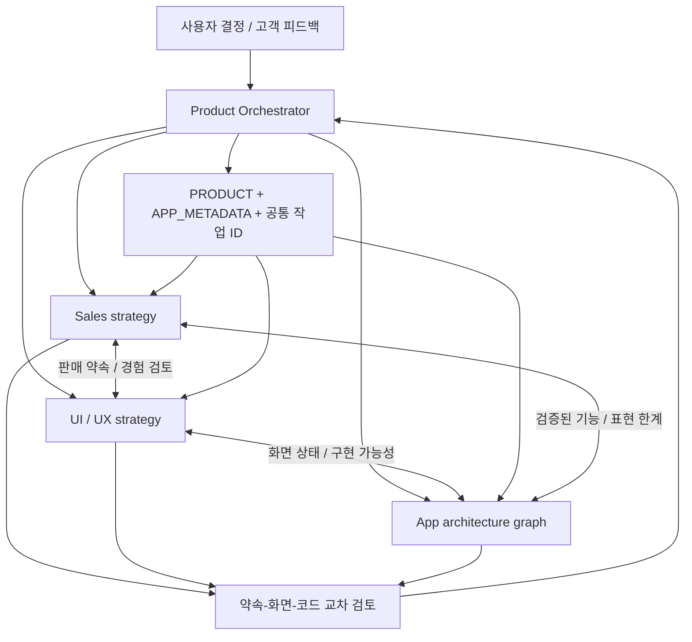

# Offzone Product Orchestrator

Strategy revision: **G1** · Updated: **2026-09-06**

## 공통 제품 기준

- **확정된 사용자 방향:** 영어를 메인 언어로 하는 글로벌 자기관리 고객. 학생·한국 시장으로 한정하지 않는다.
- **고객 문제:** 의도 없이 앱을 여는 습관을 줄이고, 원하는 일·휴식·관계·개인 시간을 지키기.
- **제품 범위:** 현재 iPhone의 디지털 자기관리. 운동·식단·의료 등 모든 자기관리 기능을 추가한다는 뜻이 아니다.
- **영어 우선:** 고객용 UI·온보딩·스토어·지원 문안은 영어가 원본. 한국어는 보조 현지화. 내부 보고서는 한국어로 운영 가능.
- **상황별 메시지:** `work`, `rest`, `presence`, `personal`의 네 맥락을 시험한다. 학습은 개인 목표의 한 예시이며 고객 자격 조건이 아니다.
- **가격·사업 모델:** 현재 파일의 Pro 자동화·관리·기록 제안을 유지하되 모두 미확정이다. 유료 통행권은 기존 설계이며 구현·출시 결정과 분리한다. 콘텐츠 사업으로 임의 전환하지 않는다.
- **현재 작업 범위:** 사용자 “단계별로 실행” 지시에 따라 U1의 R1부터 실제 앱을 구현한다. 첫 묶음은 영어 전환·실행 상태·무료 복구·저장/적용 분리·삭제다. 실기기 게이트를 통과한 뒤 후속 기능을 진행하며, 게시·배포·상시 자동 실행을 완료했다고 간주하지 않는다.

## 책임과 자료

| 담당 | 소유 산출물 | 책임 |
|---|---|---|
| 오케스트레이터 | 이 문서, PRODUCT.md, APP_METADATA.json | 사용자 기준, 공통 우선순위, 상충 조정, 최종 정합성 |
| Sales | SALES_STRATEGY_REPORT.ko.md | 타깃 상황, 포지셔닝, 유입, 상품·가격 실험 |
| UX | UX_STRATEGY_REPORT.ko.md | 고객 여정, 화면·상태·영어 문안, 접근성·유료화 경험 |
| Architecture | APP_GRAPH.md, APP_GRAPH.json, graphify-out/ | 실제 구성과 제안 구조, 의존성, 구현 가능성·검증 한계 |
| Mascot Design | `.claude/agents/room-mascot-designer.md`, `.claude/skills/room-mascot-design/SKILL.md` | 선택 캐릭터의 동일성, 상태 이미지, 실제 화면 배치·시각 검수 |

오케스트레이터는 **요청이 들어올 때 실행하는 협업 절차와 역할**이다. 현재 파일은 상시 실행 서비스나 앱 내부 기능이 아니다. 이번 문서 조율처럼 전문 담당을 실제로 호출할 수 있으며, 도구가 없는 환경에서는 같은 절차를 순서대로 수행한다. 모든 요청에 세 명을 불필요하게 호출하지 않는다.

### 자료 우선순위와 소유권

사용자 결정 → 이 문서의 결정 로그 → PRODUCT.md의 제품 기준 → 세일즈·UX 제안 순으로 적용한다. **구현 사실은 별도 축**으로 소스·실기기 검증이 우선이며, APP_METADATA.json과 APP_GRAPH.json은 이를 설명하는 산출물이다. 문서와 코드가 다르면 코드가 틀렸다고 추정하지 말고 구현 차이로 기록한다.

DESIGN.md는 시각 규칙, MOTION.md는 Roomie 동작을 유지한다. 새 고객 여정과 영문 카피는 UX 전략에서 관리한다. 기존 한국어 와이어프레임은 과거 예시이며 영어 고객 문안의 기준이 아니다. 공유 파일은 오케스트레이터 한 명이 수정해 동시 덮어쓰기를 방지한다.

앱 업그레이드의 실행 범위·인력 가정·단계별 완료 조건은 [APP_UPGRADE_PLAN.ko.md](APP_UPGRADE_PLAN.ko.md)의 U1을 사용한다. 기존 공통 ID를 실행 단위로 구체화한 계획이며, 구현 상태·가격·납기 확정을 대신하지 않는다. 계획서의 소유자는 오케스트레이터다.

## 공통 작업 ID

| ID | 공통 작업 | 현재 단계 |
|---|---|---|
| ALIGN-01 | 영어 우선·글로벌 자기관리 기준 동기화 | 영어 기본 코드·한영 리소스 반영; 전체 실기기 흐름 대기 |
| CORE-01 | 실기기 차단·해제·일정 신뢰성 | 실행 상태 저장·경합 방어 구현/시뮬레이터 검사; 실기기 대기 |
| SAFE-01 | 상시 무료 복구·필수 앱 예외 | 무대기 무료 복구 구현; 실기기 검증·필수 앱 예외 남음 |
| ACT-01 | 첫 작동 체험·권한 순서 | 제안 |
| RULE-01 | 규칙 관리·요일·NFC 연결 | 저장/적용 분리·삭제 구현; 요일·태그 연결은 R2 |
| INSIGHT-01 | 정직한 보호 구간과 회고 | 미구현 |
| BREAK-01 | 계획 휴식·복귀 | 미구현·실기기 선행 |
| OFFER-01 | Pro 가치·상품 경계·가격 실험 | 해제권 클라이언트 연결·판매 비활성; 상품/보상/실기기 미확정 |

각 담당은 같은 ID에 대해 **고객 문제 → 판매 약속 → 화면 행동 → 코드/의존성 → 측정 → 완료 조건**을 연결한다. 독립적인 우선순위 목록을 별도로 확정하지 않는다.

### 통합 판단표

| ID | Sales가 확인할 가치 | UX가 확인할 경험 | Architecture가 확인할 의존성 | 다음 단계 통과 조건 |
|---|---|---|---|---|
| ALIGN-01 | Work/Rest/Presence/Personal 메시지 | 영어 원문·중립적인 첫 선택 | en 개발 지역·영어 소스 키·한영 리소스 | 문서/리소스 일치 및 실제 영어·한국어 흐름 검증 |
| CORE-01 | 맡길 수 있는 자동화 | 실제 상태·예정 종료·진단 표시 | 단일 제한 적용 경로·앱/확장 이벤트 | 서명된 기기 결과, 지속 차단 결함 해결 |
| SAFE-01 | 구매와 무관한 통제권 | 상시 Restore access·긴급/오류 복구 | 상시 진입·복구 상태 저장 구현; 필수 앱 예외 남음 | 서명된 기기에서 실제 해제 및 재개 조건 확인 |
| ACT-01 | 첫 가치 경험 | 최소 대상·체험·권한 순서 | 수동 체험과 안전한 예약/해제 경로 | 혼자 작동 확인·해제 완료 |
| RULE-01 | 생활에 맞는 재사용 규칙 | Save와 Activate 구분·요일·태그 연결 | 저장/실행 스냅샷 분리 완료; 태그 ID·요일 추가 필요 | 저장 의도·활성 상태 일치, 실패 복구 |
| INSIGHT-01 | 반복 사용 가치 | 보호 구간과 짧은 회고 | 세션 저장·중복/불명 구간 처리 | 절약·집중 시간으로 과장하지 않는 집계 |
| BREAK-01 | 계획한 휴식 뒤 복귀 | 종료·복귀 시각과 실패 안내 | 예약·재차단·상태 복구 | OS 상태별 실제 종료 확인 |
| OFFER-01 | 자동화·관리·기록 Pro 제안 | 가치 확인 후 명확한 구매·무료 유지 | 과금 상태·복원·심사·가격 | 고객 가치·기술·UX 검토와 실제 상품 검증 |

### 우선순위를 정하는 기준

현재 제안 순서는 ALIGN-01로 기준을 맞춘 뒤 CORE-01/SAFE-01 → ACT-01/RULE-01 → INSIGHT-01/BREAK-01 → OFFER-01이다. 개발 기간은 가용 인력·실기기 결과에 따라 정하며, 문서 완료를 기능 완료로 바꾸지 않는다. 독립적인 가격 조사나 영문 카피 검토는 앞 단계와 함께 진행할 수 있다.

한 변경을 채택할 때 기록할 최소 항목은 작업 ID, 고객 문제, 근거, Sales 약속, UX 행동, 코드 의존성, 성공 지표, 중단 조건이다. 숫자 점수를 임의로 합산하기보다 실제 병목과 근거를 우선한다.

## 운영 원칙

사용자 결정은 제안보다 우선한다. 구현 사실은 코드와 실기기 증거를 기준으로 하며, 문서를 바꿨다고 구현된 것으로 승격하지 않는다. 일반 질문에는 직접 답하고, 전략·UX·기능·언어·상품 변경 요청에는 영향받는 담당만 호출한다.

1. 오케스트레이터가 변경 범위·공통 ID·담당 파일을 정한다.
2. 담당들이 소유 파일을 검토·수정하고 서로 발견·충돌을 전달한다.
3. 세일즈의 약속을 UX가 화면에서 검증하고, Architecture가 코드·플랫폼에서 검증한다.
4. 오케스트레이터가 상충을 결정 로그에 남기고 공통 백로그·메타데이터를 동기화한다.
5. 근거·참조·그래프·언어·가격의 정합성을 확인한 뒤 결과와 미구현 범위를 보고한다.

재사용 실행 지침: [.claude/skills/room-product-orchestrator/SKILL.md](.claude/skills/room-product-orchestrator/SKILL.md).

### 충돌이 생기면 어떻게 결정하는가

| 충돌 예시 | 조정 |
|---|---|
| Sales: 첫 화면에서 Pro 결제 / UX: 아직 가치 이해 전 | ACT-01로 첫 작동을 먼저 보여 주고 OFFER-01로 과금 시점 별도 실험 |
| Sales: 방에 들어오면 즉시 차단 / Architecture: GPS 150m·이벤트 지연 | 실제 장소 범위·NFC 스캔을 설명하는 문구로 수정; 자동 방 감지 약속 금지 |
| UX: 60초 체험 자동 종료 / Architecture: 백그라운드 예약 미검증 | 사용자 확인 목표와 OS 보장을 구분하고 안전한 종료 경로 검증 후 제공 |
| Sales: 모든 학생을 대상으로 최적화 / 사용자: 전반적 자기관리 | 사용자 기준 유지; 학습은 Personal time의 실험 소재만 가능 |
| UX: 즉시 긴급 해제 / 과거 코드: 10초 대기 | R1에서 상시 무료 진입과 대기를 제거했다. 물리적 해제 성공은 실기기에서 별도 검증한다. |

결정 근거가 부족하면 실험안을 남긴다. 담당끼리 투표해서 구현 사실·플랫폼 제약을 덮어쓰지 않는다. 한 담당의 제출로 공통 작업을 완료 처리하지 않고, 영향받는 상대 담당의 검토를 거친다.

### 완료의 세 단계

- **문서 정합성 완료:** 같은 타깃·영문 약속·작업 ID·상태를 사용하고 참조가 유효하다.
- **구현 완료:** 해당 코드 변경과 적절한 검증이 끝났으며 그래프·메타데이터에 반영된다.
- **출시 가능:** 실기기·권한·개인정보·접근성·상품/심사 게이트가 통과했다.

최초 G1 작업은 문서 정합성까지 완료했다. 현재 R1 첫 묶음의 코드와 로컬 검사 결과는 [R1_IMPLEMENTATION_STATUS.md](R1_IMPLEMENTATION_STATUS.md)에 기록한다. R1 전체와 출시 가능 상태는 아직 완료하지 않았다.

G1 확인 결과: 메타데이터 기능 12개와 제품 그래프의 상태·참조가 일치하고 공통 작업 8개가 세 보고서에 연결된다. `python3 tools/check_product_alignment.py --self-test`는 정합성 검사와 의도적으로 만든 불일치 5개의 거부를 확인한다. 세일즈 계산·문안 길이·문서 링크 검사, 코드 그래프 재생성·브라우저 표시도 확인했다. [협업 검토 기록](_workspace/01_harness_review.md)은 실제 역할 간 조율과 수동 시나리오 검토 범위를 구분한다. 이 검사는 기능의 실기기 성공이나 판매 효과를 입증하지 않는다.

## 다음 요청에서 사용하는 방법

“오케스트레이터 기준으로 ACT-01부터 구현해줘”, “이 유료화 제안을 세일즈·UX·기술 관점에서 검토해줘”, “현재 구현에 맞춰 그래프와 두 보고서를 업데이트해줘”처럼 요청한다. 작업을 받으면 영향을 받는 파일·담당만 읽고 갱신한다. 단순 보고서 브리핑은 팀 호출 없이 답한다.

## 결정 로그

| ID | 상태 | 결정·근거 |
|---|---|---|
| D-01 | 사용자 확정 | 글로벌 자기관리 고객, 영어 메인. 기존 한국 학생 우선 가설을 대체한다. |
| D-02 | 운영 채택 | 상황별 메시지를 분리 시험하되 제품·고객 범위를 특정 직업·학생으로 축소하지 않는다. |
| D-03 | 운영 채택 | 코드상 구현과 제안 그래프를 분리한다. 영어 원본 전략과 런타임 언어 상태를 구분한다. R1에서는 영어 소스 키로 전환했다. |
| D-04 | 미확정 | Pro 구성·가격·통행권 채택 여부는 지불 의사, UX, 기술 신뢰성·심사 검토로 결정한다. |
| D-05 | R1 코드 반영·기기 검증 대기 | SAFE-01: 상시 무료 복구 진입과 강제 대기 제거. 정상 GPS 구간은 예정 종료까지 복구, NFC는 새 스캔, 불명확 상태는 명시적 재개. 저장 실패는 별도로 표시한다. |
| D-06 | 가격·카피 제안 | English headline: Make room for what matters. Pro 연 $19.99/$29.99 비교는 USD 실험 가정이며 국가별 출시·가격이나 리브랜딩 확정이 아니다. |
| D-07 | 사용자 실행 지시 | “단계별로 실행”에 따라 R1 런타임 수정을 시작했다. 수동 체험은 CORE/SAFE 실기기 게이트 이후, R2/R3는 U1의 선행 조건을 유지한다. 가격·배포 승인으로 확대하지 않는다. |
| D-08 | 사용자 UI 수정 지시·2026-09-07 | 불필요한 부연설명 제거. 홈은 짧은 상태·시간·규칙 행동 중심으로, 정상 상태/성공 문단은 숨긴다. 실패는 명시적 오류로 표시하고 권한·복구·삭제 판단 정보는 해당 맥락에 유지한다. |
| D-09 | 사용자 시각 개편 지시·2026-09-07 | 기존 Roomie와 기능·정보 구조는 유지하고, 앱 소유 화면을 밝은 종이색·얇은 잉크 그리드·절제된 파스텔 셀·역할별 시스템 서체로 개편한다. 레퍼런스의 달력·통계·탭은 미구현 기능이므로 가져오지 않는다. 상시 무료 복구와 저장/적용 분리를 시각 개편보다 우선한다. |

| D-10 | 사용자 네이티브 적용 지시·2026-09-07 | 승인한 Roomie v2 디자인을 실제 iPhone 앱에 적용. 기존 기본 서체는 유지한다. 중앙 상태 영역·가벼운 규칙 목록·설정/복구 화면과 실제 결과 기반 Roomie 반응을 옮기되 차단 정책·저장/활성화 분리·무료 복구는 유지한다. 시뮬레이터 검증과 실기기/재방문 효과 검증은 구분한다. |

| D-11 | 사용자 리포트 기반 업그레이드 지시·2026-09-07 | ACT-01/OFFER-01의 개인화 온보딩과 선택적 Apple 계정·RevenueCat 구독 코드를 현재 단계에서 구현한다. 기존 단계 순서보다 최신 사용자 지시가 우선한다. 기본 서체·기존 무료 규칙·복구는 유지하며, 미확정 Pro 혜택·가격과 미제공 외부 설정은 출시 완료로 간주하지 않는다. 유료 기능 확정 및 상품 검증 전 OfferReady=false. |

| D-12 | 사용자 구역 알림·해제권 화면 지시·2026-09-07 | CORE-01/RULE-01: 활성 GPS 구역의 확인된 진입·이탈 및 공유 차단 정책 시작·종료에 선택형 로컬 알림 추가. OFFER-01: 일반 조기 종료, 활성 규칙 교체·삭제를 해제권 안내 화면으로 연결. 1회 구매로 현재 세션 종료를 제안하며 예전 15분 휴식 상품과 구분한다. 현재 상품·가격·잔액/소비 검증은 없고 구매 버튼은 비활성이다. SAFE-01 오류·긴급 무료 복구는 유지. NFC는 별도 준비된 물리 태그를 앱에서 읽으며 이탈 감지·태그별 규칙 연결은 미구현. Offzone 명칭 방향은 승인됐으나 기술 ID·백엔드 등록 변경은 별도 작업이다. |

| D-13 | 사용자 화면 잠금/삭제 방지 요청·2026-09-07 | 전체 기기 잠금·결제만으로 해제는 개인 Screen Time 앱에서 보장할 수 없다. 구현 범위는 규칙별 선택형 `denyAppRemoval`: 실제 차단 정책이 참인 동안 모든 앱의 삭제를 제한하도록 요청한다. 기존/신규 규칙 기본 꺼짐, 저장과 적용 분리, 종료·이탈·복구·오류 시 같은 저장소의 제한 해제. 개인 권한 철회 가능성을 고지하며 실기기 삭제 방지와 상품 결제는 미검증/미구현. SAFE-01 무료 오류·긴급 복구 유지. |

| D-14 | 사용자 명칭 적용 지시·2026-09-07 | ALIGN-01: 고객용 앱 이름을 Offzone / 오프존으로 확정하고 앱 표시명·UI·권한·NFC·Shield·계정/Pro 문구와 현재 문서·스토어 초안을 변경한다. Roomie/룸이와 기본 서체는 유지한다. 저장 데이터 호환을 위해 bundle ID·App Group·Swift/Xcode 명칭·NFC URL은 유지하며, Firebase/RevenueCat 콘솔 표시명과 Apple 등록은 별도 설정 작업으로 남긴다. |

| D-15 | 사용자 Firebase·RevenueCat 설정 재개·2026-09-07 | 기존 프로젝트를 Offzone으로 변경하고 Firebase Apple 인증/키·Firestore 규칙을 실제 구성 및 조회 검증. Apple App ID·인증 Service ID·App Store 초안과 RevenueCat iOS 앱/Pro entitlement 생성. 공개 SDK 키와 서명 팀은 앱에 반영. 구매 키는 업로드했으나 Apple HTTP 401 검증 오류; 상품/가격/혜택·실기기 로그인/구매 미검증이므로 유료 제안은 비활성 유지. 상세 사실은 ACCOUNT_PURCHASE_SETUP.md. |

| D-16 | 남은 설정 계속 진행·2026-09-07 | Apple 확장 ID/App Group 연결, RC 구매 키 Valid credentials 및 sandbox TEST 전달 확인. 3개 상품/Pro offering/PASS 지급 연결, 고정 1회권 소비·RC 계정 삭제 서버 코드와 로컬/합성 원장 검증 완료. 가격·체험·Pro 혜택, Xcode 계정/실기기 검증, 유료 해제 UI/세션 경합 처리는 미완료이며 판매 비활성 유지. Blaze와 서버 배포는 D-17에서 완료. |

| D-17 | 새 결제 계정 사용자 승인·2026-09-07 | 내 결제 계정 2에 Offzone 연결 및 Blaze 전환 완료. 월 1만 원 알림(50/90/100%, 지출 차단 아님), RC 서버 Secret v1, 해제권 소비/계정 삭제 함수 2개 배포 ACTIVE 확인. 인증 없음/잘못된 토큰의 실제 호출 401 확인. 기존 결제 계정과 프로젝트는 변경하지 않았고 할당량 지원 요청은 미제출 폐기. 실제 결제·유료 해제 UI/실기기 검증은 여전히 미완료. |
| D-18 | 해제권 클라이언트 연결·2026-09-08 | RevenueCat 실제 소모성 상품/PASS 잔액 조회, Firebase 인증 callable 차감, UID별 원자적 요청 저장과 동일 ID 재시도, 런타임 generation+현재 일정 회차의 잠금 내 검증·해제를 구현했다. 별도 `RoomUnlockPassReady=false`로 유료 호출을 비활성 유지한다. 늦은 확정의 악용 불가능한 보상 정책, 실제 가격·구매·지급·계정 전환·환불·실기기 해제가 남아 있으며 무료 긴급 복구는 모든 상태에서 유지한다. |
| D-19 | 사용자 공식 로고·색감 지시·2026-09-08 | 제공된 라임 배경·차콜 `off` 워드마크를 공식 로고/AppIcon으로 확정한다. 앱은 로고 라임 `#DBF162`와 차콜 `#1B2521`을 중심으로 조정하고 Roomie도 같은 색 체계로 맞춘다. 기존 기능·상태 모션·시스템 서체·접근성·무료 복구는 유지한다. |
| D-20 | 사용자 색상 복원 지시·2026-09-08 | D-19의 앱/Roomie 라임 전환을 취소하고 기존 Roomie v2 색상을 복원한다. 공식 `off` 로고의 형태는 유지하되 종이색 `#FAF9F3`·딥그린 `#223E38`로 맞춘다. |
| D-21 | 유료 준비 후속·2026-09-09 | 사용자 남은 작업 지시로 해제권 en/ko 상품 문안·전체 지역 저장, 미도달 차감 요청의 서버 취소와 지연 차감 차단·확인 UI 구현/시뮬레이터 및 에뮬레이터 검증. 유료 계약·은행 활성화, EU 재심사 중. 이미 차감된 만료 세션의 보상 정책, 가격·Pro 범위와 실기기 구매 검증은 미확정이므로 판매 플래그는 유지한다. 기존 앱 1.0 심사 중이며 취소하지 않았다. |

| D-22 | 사용자 Pro 동시 준비·2026-09-09 | 해제권 USD0.99 사용자 확정. Pro 주간 목표 계획·수동 회고·주간 요약·내보내기 구현 및 구독 만료/현재 계정 검사, 기존 데이터 읽기·삭제·내보내기는 무료 유지. 자동 Screen Time 기록이나 추가 차단 유료화는 포함하지 않는다. 월/연 구독 가격은 사용자 답변 대기. 첫 유료 상품은 새 앱 버전 심사 필요; 판매 플래그와 기존 심사는 유지. |

| D-23 | 사용자 Pro 가격 확정·2026-09-09 | 월 USD4.99 / 연 USD29.99 확정. 가격 재승인 불필요. ASC 가격 저장·검증은 다음 채팅에서 진행; 체험 미승인. 공개 privacy v3 배포 완료. 실제 구매 검증·유료 새 빌드/상품 심사는 미완료이므로 판매 플래그 false 유지. 최신 인계는 `_workspace/PRO_IMPLEMENTATION_STATUS.md`. |

| D-23 | 유료 준비 후속·2026-09-09 | Pro 월 USD4.99/연 USD29.99 사용자 승인, ASC 175지역 저장·재조회 완료(한국 월7700/연49000). 결제 전 기기 내 저장·백업 제외 안내를 기존 한영 문구로 추가. 해제권은 Apple4.10의 Screen Time API 유료화 금지와 직접 충돌 우려로 계속 판매 비활성, 정책 검토는 `_workspace/PAID_POLICY_REVIEW.md`. 실제 구매·기기·심사 완료 아님. |

| D-24 | 사용자 Google·이메일 추가 승인·2026-09-09 | ACT-01/OFFER-01: Apple 유지, Google 및 이메일/비밀번호 가입·로그인·인증·재설정·명시적 동일 UID 연결·제공자별 재인증 삭제 구현. Firebase3종 활성화 재조회. 새 이름/이메일 수집 고지와 공개 privacy v4 반영. 실제 OAuth/메일 수신·연결/삭제/구독 복원 검증 및 새 빌드 제출 미완료; 기존 심사 유지. |

| D-25 | 사용자 NFC 제거·장소 개선 승인·2026-09-16 | CORE-01/RULE-01/ACT-01: 기존 Apple 지도에서 검색/핀 조정, 오차를 고려한 주변 도착 확인 후 명시적 Start focus. 자동 진입 차단과 NFC 스캔 제거, 기존 NFC 규칙은 실행 중지·장소 재지정 편집 허용. SAFE-01 복구 및 일정 종료 유지; 신규 회차/이탈/복구 후 재확인 필요. 실제 iPhone 검증·새 빌드 심사와 구현 완료는 구별한다. |

| D-26 | 사용자 깨비 재사용 지시·2026-09-21 | ACT-01: Jumggabe 원본 HTML 8종 SVG를 SwiftUI 상태별 캐릭터로 적용. Roomie 그림 대신 깨비, 앱 팔레트·off 로고 유지. 자산 원본·구문 검증과 Xcode 빌드/기기 검증은 구분. design/character/README.md 참조. |

| D-27 | 사용자 해석 정정·2026-09-21 | D-26의 그대로 복사를 대체: 기존 8종을 Offzone에 맞게 리디자인. 종이색·세이지 새싹·얇은 딥그린 선, 운세 장식 제거, 작은 첫 화면과 절제한 상태 모션. |

| D-28 | SUIT 확정 및 고양이 레퍼런스·2026-09-21 | 사용자 최신 지시: SUIT 한영 동적 서체, 버터색·잉크 손그림 고양이8종을 네이티브 적용. 기존 새싹 깨비를 대체. 안전 복구/상태/지도 동작 유지. |

| D-29 | 키위새 최종 지시·2026-09-21 | D-28 고양이 취소: 첨부 키위새의 갈색 둥근 몸·긴 노란 부리·점눈을 네이티브8종으로 적용. SUIT/버터색 유지. |

| D-30 | 사용자 Veo 키위 앱 적용 승인·2026-09-22 | 승인된 Lite 영상의 무음 정방향/역방향 루프를 환영·대기·안내·로딩에 적용. 집중·오류·완료 상태 이미지는 유지. 동작 줄이기에는 정지 이미지, 비활성·화면 밖 재생 중지. 자연스러운 방향 전환 영상 생성이나 추가 API 과금 없음. |

| D-31 | 흰 마스코트 배경 제거·2026-09-22 | D-30의 흰 카드 제거. 영상은 HEVC alpha MOV, 정지 이미지는 투명 PNG로 교체하여 실제 화면 배경을 그대로 표시. 왕복/무음/접근성 동작 유지. |

| D-32 | 사용자 Kotlin Android 구현 승인·2026-09-22 | iOS SwiftUI 유지, 별도 android/에 Kotlin + Compose 첫 버전 구현. CORE-01/SAFE-01/ACT-01: 사용자 명시적 시작·선택 앱 차단·단조 시계 만료·무료 해제. 첫 범위는 시스템 앱 제외, 앱 선택/동의만 저장, 서비스 종료·재부팅 시 세션 종료. 장소·로그인·구독·Play 등록/배포는 이번 범위 밖. 검증 결과는 android/README.md. |

| D-33 | 사용자 Android 전체 마이그레이션 지시·2026-09-24 | D-32의 첫 범위를 확장: Kotlin Android 규칙/장소/일정/계정/기록/구독 연동/키위 상태를 iOS 범위로 구현한다. 명시적 시작·무료 복구·영어 우선/한국어 유지. 판매 플래그와 배포는 기존 검증 게이트 유지. Android OS 제약은 실제 동작으로 구별하고, 구현과 기기/구매 검증 완료를 혼동하지 않는다. |

| D-34 | 남은 Android 작업 완료 요청·2026-09-24 | 전용 외부 업로드키로 APK/AAB 서명 검증, Firebase 업로드/Play 인증서 등록, 앱 한정 RevenueCat Play 연결/RTDN, 공개 Android privacy/support v5 배포. 내부 테스트 출시명/노트 초안 저장; 지속 위치 확인 별도 동의·취소/이전 요청 무효화 검사 통과 및 최종 재서명, 실제 스토어 화면 6장 준비. AAB 업로드는 Chrome 파일 접근 설정 대기. 사용자가 현재 실기기 연결 불가 확인; 실제 OAuth/구매/기기 검증 및 판매 플래그 게이트 유지. |

| D-35 | Chrome 파일 접근 설정 완료·2026-09-24 | 최종 AAB1(0.1.0)을 Play 내부 초안으로 업로드·원격 확인. 승인 가격의 월간/연간 상품 초안과 RC Pro/기존 offering 연결, 실제 Android 화면5장·설명·삭제URL/계정방식 초안 저장. 판매·상품 활성화·테스터 배포·심사 제출 없음. 구매 API/실기기·정책/필수시각자산 게이트 남음. |
| D-36 | 사용자 새 마스코트 오마주 방향 탐색·2026-09-24 (초기 러프 폐기) | ACT-01/SAFE-01/ALIGN-01: 첫 코드 SVG `Rue`는 디자인 품질·생성 방식이 사용자 기대에 맞지 않아 **채택하지 않음**. 원본 Kiwi/앱 코드/Play 아트워크는 유지. 후속 D-37의 실제 이미지 생성 시안이 대시보드 기본 비교를 대체한다. |
| D-37 | 사용자 Codex 이미지 생성으로 다시 제작 지시·2026-09-24 | Codex **내장 image_gen** 실제 호출로 오리지널 `Rue v2` 앵커/표정 시트 두 개를 생성(첫 사실적인 생성은 폐기), 8상태 PNG 및 기존 Kiwi와의 별도 갤러리를 대시보드에 교체. 참조 그림은 분위기만 참고, 복사·재배포 금지. 4개 브라우저 단발 CSS 모션은 정지 그림 기반 연구이고 네이티브 애니메이션/생성 영상은 아님. 무료 Restore access와 명시적 Start focus, 영어 우선을 시안에 반영. **캐릭터 채택, iOS/Android 설치, 실제 화면/스토어/출시 승인은 아직 없다.** 프롬프트·원본 해시·한계는 `DESIGN_BOARD.md` 최신 링크에 보존. |
| D-38 | Rue를 더 어려 보이고 예쁘며 수줍은 분위기로 표현해 달라는 요청·2026-09-24 | 기존 v2를 보존하고 Codex 내장 image_gen으로 **앳되고 수줍은 성인**의 별도 v3 후보·표정 시트2를 생성; 대시보드에서 Kiwi/이전 Rue/새 Rue를 비교한다. 배경 워시 때문에 제품용 완전 투명 자산은 미완성. 모션은 브라우저 CSS 정지 PNG 변형이고 네이티브·스토어/실제 앱 화면 변경 없음. 명시적 Start focus와 무료 Restore access·영어 우선 원칙 유지. 선택·권리 검토·축소/접근성/기기 검증·앱/Play 적용은 사용자 별도 지시가 필요하다. `DESIGN_BOARD.md`의 최신 링크를 참조한다. |
| D-39 | Rue v3 얼굴·의상 조금 더 예쁘고 노출감 있는 수정·2026-09-24 | 사용자는 v3가 더 좋아졌다고 평가했고, 같은 **성인** Rue의 얼굴을 살짝 다듬고 V/스쿱 목선으로 쇄골 일부만 보이는 옷차림 변형 v4를 요청. Codex 내장 image_gen으로 새 앵커/표정 시트2를 만들고 Kiwi·이전 Rue v3·v4를 비교. 이전 시안 보존, 제품용 깨끗한 alpha 미확보, 네이티브/Play/실제 스크린샷/결제/출시 변경 없음. ACT-01/SAFE-01/ALIGN-01(명시적 시작·무료 복구·영어 우선)은 유지. 채택·실기기·원본성/사용권/축소 가독성/접근성·적용은 별도 사용자 결정. `DESIGN_BOARD.md`의 최신 링크 참조. |
| D-40 | Rue v4 치마를 살짝 짧게·2026-09-24 | 사용자 요청대로 Codex 내장 image_gen으로 **성인** Rue v4 전신 앵커의 진회색 A라인 치마 밑단만 무릎 부근으로 올린 별도 v5 PNG를 생성. Kiwi·긴 치마 v4·새 v5를 대시보드에서 비교하고 v4/v3/v2를 보존. 얼굴·목선·수줍은 표정, ACT-01/SAFE-01/ALIGN-01은 유지. 두 시트·표정8·웹 CSS 모션4·HTML 개념폰3은 **v4 자산을 재사용**하므로 새 표정/영상/네이티브 구현이라고 주장하지 않는다. 완전 투명 alpha/원본성·권리/축소·기기 검증은 미완료, 앱/Play/실제 캡처 보드/배포 수정 없음. 채택/설치는 사용자 별도 결정. `DESIGN_BOARD.md` 최신 링크 참조. |
| D-41 | Rue v5 치마를 더 짧은 숏스커트로·2026-09-24 | 사용자 요청에 따라 Codex 내장 image_gen으로 **성인** Rue v5의 진회색 A라인 밑단만 무릎 위로 올린 새 전신 v6 PNG 1장. Kiwi·무릎길이 v5·무릎 위 v6를 대시보드에서 비교, 이전 v5/v4/v3/v2 보존. 동일 얼굴·상의·목선·포즈 유지, 과도한 노출/학생·미성년 설정 없음. v4 표정2시트·8상태·CSS 모션4·HTML 개념폰3은 v5를 거쳐 **재사용**; 새 표정·영상·네이티브 구현 주장이 아니다. 제품용 alpha·사용권/원본성·축소·기기 QA 미완료. ACT-01/SAFE-01/ALIGN-01 유지; 앱 Kiwi/Play/실제 캡처 보드/결제/출시 미변경, 적용은 별도 결정. `DESIGN_BOARD.md` 최신 링크 참조. |
| D-42 | 성인 Rue v6 시각 방향 선택·상태 레퍼런스/적용 설계·2026-09-24 (과거 설계 단계) | 사용자가 v6가 좋다고 평가하고 **이 버전 기준 새 표정·상태별 레퍼런스와 앱 적용 설계**를 요청. Codex 내장 image_gen으로 v6 앵커에서 새 상반신 시트2/전신 시트1(마스터3) 생성, 표정8+치마가 보이는 전신4를 크롭·원본/해시 보존. 앞선 v6 비교 시안의 표정은 v4 재사용이지만 이번 12컷은 신작. 소스에서 iOS 13 RoomSpiritState→8 Kiwi 자산과 키위 영상 우선 경로, Android 실제 onboarding/Home의 주 두 Kiwi 연결을 확인해 `IMPLEMENTATION_PLAN.md`에 상태 우선순위·사전 복구와 성공 후 구분·iOS/Android 정적 교체→접근성/기기 QA·롤백을 설계. ACT-01/SAFE-01/ALIGN-01 유지. 당시 시각 방향 선택은 **앱 설치/Play·아이콘·실제 스크린샷 보드/결제·출시 완료**가 아니었다. 제품용 clean alpha/권리·유사도·축소/실기기 게이트는 후속 D-43에서도 열려 있다. `DESIGN_BOARD.md` 최신 링크 참조. |
| D-43 | Rue v6 마스코트 전면 교체·의상 여러 버전 준비·2026-09-24 | 사용자가 **"다 교체해, 마스코트는 저걸로 고정"**하고 아바타처럼 옷을 보상/구매할 수 있는 미래 방향을 제시. iOS `RoomSpirit` 13상태 → 새 Rue 상반신8/대형 전신4(선택 v6 welcome 원형), Kiwi MOV/포스터·asset catalog·Kotlin `KiwiView`/WebP/vector 제거, 안전해제 실행 전 `.attentive`(성공 전 `.recovered` 방지), 영/한 인사·테스트 새 이름. 원본 Kiwi 전부 `2026-09-24-kiwi/` 이력으로 보존. 원본 12그림을 정적 리소스로 다운샘플·저알파 워시 감쇠했으나 **clean alpha 인증 아님**. iOS Simulator build + 전체 XCTest25(1 skip, 0 failure), Android debug+androidTest compile / emulator 2 test, 양쪽 초기 화면 렌더 확인; Android 초기 System UI ANR는 Wait 후 정상 화면 확인, 앱 ANR로 단정하지 않는다. Codex 내장 image_gen 새 3개 전신 의상(네이비/테라코타, 브라운/파인, 라벤더/인디고) 생성, 기본 v6 포함 갤러리와 provenance/해시/wardrobe plan 보존. **앱은 기본 Rue만**; 새 의상은 상태별·레이어드 rig 없이 장착 불가한 시안이며 보상/구매/상품·가격/앱 상품화/스토어/배포 미승인·미구현. 향후 자유로운 장착·검증된 보상/영수증/환불/복원과 무료 복구·명시적 Start focus의 분리 필요. 공식 `off` 아이콘, 기존 Play 내부초안/실제 보드 revision20 유지. 사용권/원본성·투명 컷아웃·실기기 Screen Time/Accessibility+접근성 QA 후 출시에 대한 별도 결정. |
| D-44 | 사용자 Nook Cat 최종 선택·앱 적용·2026-09-25 | 사용자가 귀요미 10종 디자인보드의 **F, Nook Cat**을 최종 마스코트로 선택하고 새 상태 이미지 생성과 iOS/Android 앱 배치를 지시했다. D-43의 Rue 고정은 당시 결정으로 보존하되 현재 시각 방향은 Nook Cat이 우선한다. 기준은 [보드 F](.growth-design/mascots/2026-09-25-cute-10x10/index.html#candidate-F)의 크림색 털·짙은 녹색 눈·니트 조끼다. 원본의 장면 배경을 앱에 복사하지 않고 내장 image_gen으로 새 RGBA 정적 12컷(표정8·전신4)을 만들었다. iOS `RoomSpiritState` 13상태에 `OffzoneNookExpression`/`OffzoneNookFullBody`를 연결하고 Android 온보딩·홈에 `NookCatView`를 연결한다. 영어 우선·한국어 보조, 명시적 Start focus, 무료 Restore access, 공식 `off` 아이콘을 유지한다. iOS 대상 XCTest 1/1(최종 여백 수정 전)·최종 증분 빌드와 한국어 첫 화면/영어 네 화면, Android 에뮬레이터 온보딩 2/2와 네 화면 캡처는 확인됐으며 양 플랫폼 실기기·접근성·윤곽 프린지·사용권 검토는 별도 증거를 따른다. Rue 의상3종과 wardrobe plan은 역사적 시안이고 Nook의 장착·보상·구매·스토어/출시는 이번 적용에 포함되지 않는다. |
